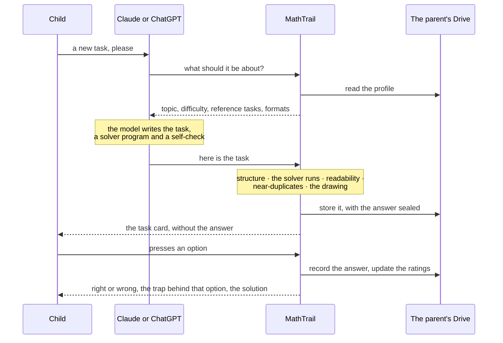

# mathtrail-standalone

Free, open-source standalone MathTrail app for LLM applications: an endless stream of checked olympiad-style maths tasks for grades 1–6, in any language, with a diagnosis of the child's mistake and a memory of how they are progressing.

It is neither a homework solver nor a drill of the school syllabus. It turns an adult's own Claude or ChatGPT chat into an adaptive olympiad trainer for a child in grades 1–6.

## How it works

MathTrail connects to Claude or ChatGPT as an app over the [Model Context Protocol](https://modelcontextprotocol.io), and draws its screens with the [MCP Apps extension](https://modelcontextprotocol.io/extensions/apps/overview). A parent (or tutor) adds it to their own chat, and the child solves tasks there:

1. The service picks a topic and difficulty for the child and gives the chat's model a brief, reference examples and formats.
2. The chat's model writes the task.
3. The service checks the task: structure, a solver program that brute-forces the answer options, readability, near-duplicates and text drawings.
4. The child sees the task in a widget, answers with a button, and gets an explanation of the mistake. Ratings are updated.

The unusual part is step 2: the task is written by the chat's own model, and the service is what decides whether it reaches the child.

Design points:

- **No LLM calls of its own.** Only the chat's model writes text.
- **Stateless.** The service stores nothing between requests. The child's profile is a JSON file in the parent's own Google Drive, and the answer to the current task is encrypted there.
- **Self-contained.** It runs as a single Go binary on Google Cloud Run: no database, no queues, no other services.

## Why not just ask the chat directly?

Ask a chat model for "an olympiad task for grade 2" and it will cheerfully hand you a task with no solution, with two correct options, or with the arithmetic wrong. MathTrail leaves the writing to the model and puts a program behind it:

- **Tasks do not run out.** Every task is written for the child's topic, difficulty, interests and yesterday's mistake, in the language of the chat — not drawn from a fixed bank in one language.
- **A program checks the model.** A task reaches the child only after it passes the checks: exactly one correct option, the answer reproduced by a brute-force solver, readability for the grade, no near-duplicate of an earlier task, a well-formed text drawing.
- **A wrong answer is a diagnosis.** Every wrong option is tied to a named trap — off-by-one in gaps, a missed case while enumerating, double counting — and the explanation starts from how the child reasoned, not from the right answer.

"Checked" means exactly what the program checks. Whether the wording, the drawing and the solution agree in meaning is checked by the model's own self-check, so this is not a promise of a flawless task every time.

## Development

All development happens in the devcontainer; nothing but Docker and VS Code is needed on the host.

1. Install Docker and VS Code with the Dev Containers extension.
2. Open the repository and choose "Reopen in Container". The first build downloads the pinned toolchain and takes a few minutes.
3. `just --list` shows the available recipes. The usual ones are `just run` to start the service, `just test` while writing code, and `just ci-lint` with `just ci-test` before calling anything done.
4. `just docker-build` and `just docker-run` build and start the runtime image; `curl localhost:8080/healthz` answers from it.

## Documents

- [docs/](docs/) — architecture diagrams, the implementation decision log and reports of live runs.
- [CLAUDE.md](CLAUDE.md) — working rules for Claude Code in this repository.

## License and trademark

The code and the bundled content (catalogs, reference tasks, model instructions) are released under the [MIT License](LICENSE).

The MIT License does not grant any rights to the name "MathTrail" or its logos. If you fork this project and run it publicly, please give your version a different name.
