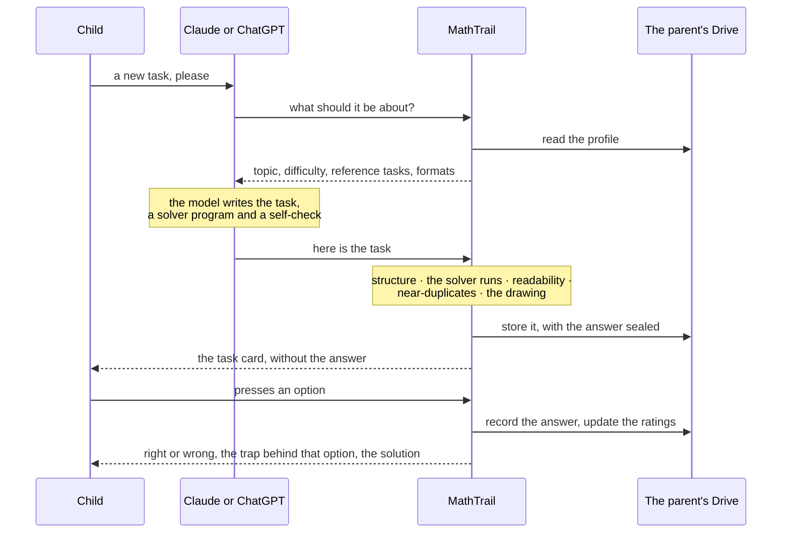

# MathTrail

A free, open-source app for Claude and ChatGPT: an endless stream of checked olympiad-style maths tasks for grades 1–6, in any language, with a diagnosis of the child's mistake and a memory of how they are progressing.

It is neither a homework solver nor a drill of the school syllabus. It turns an adult's own Claude or ChatGPT chat into an adaptive olympiad trainer for a child in grades 1–6.

## What a lesson looks like

The screens below come from the widget's approved design, which the cards in the chat are built to. They follow the viewer's light or dark theme. The fence task, its options and its traps are an example.

<picture>
  <source media="(prefers-color-scheme: dark)" srcset="docs/screens/task-dark.png">
  
</picture>

A child asks in the chat for a new task, and it arrives as a card:

- **The task.** The chat's model wrote it, and the service let it through only after its checks. The drawing is plain text, laid out left to right in any language.
- **Five options, A to E.** The answer is not in the card: it is sealed in the parent's Drive until the child picks one.
- **Help that stays the child's own.** Hint shows a leading question or a first step, which the model wrote with the task. I don't know counts as a wrong answer and shows the solution. Another task skips this one. A question typed into the field goes to the chat, and the model answers it under the card.
- **The top line.** It shows the child's pseudonym, never a real name, and opens the progress screen.

### After a wrong answer

<picture>
  <source media="(prefers-color-scheme: dark)" srcset="docs/screens/wrong-dark.png">
  
</picture>

A tap records the answer at once, before any explanation, so nothing in the chat can talk it into being right. Every wrong option was written with a named trap behind it, and the card shows the trap the child fell into — here, counting the gaps instead of the posts — then the solution. The model explains in the chat starting from that trap, not from the right answer, and the child's rating in the topic moves.

### Progress, for the child and the parent

<picture>
  <source media="(prefers-color-scheme: dark)" srcset="docs/screens/progress-dark.png">
  
</picture>

The same screen opens from the card's top line or when the child or the parent asks in the chat. It shows a chess-style rating with its rank, what comes next, the rating of every topic and the ones mastered, the recent answers, the traps that keep coming back, and the profile. All of it is one JSON file in the parent's own Google Drive.

## Add it to your chat

You need a Claude or ChatGPT account and a Google account; your child needs neither. MathTrail is used by an adult — a parent or a tutor — in their own chat (Claude is for 18+, ChatGPT for 13+), and the child solves the tasks next to them. It is free and stays free, with no payment and no advertising.

### Claude

Works now, on the free plan too:

1. In Claude, open [Customize → Connectors](https://claude.ai/customize/connectors).
2. Press **+** and choose **Add custom connector**.
3. Paste the address: `https://mcp.mathtrail.app/mcp`
4. Press **Add**, then **Connect**, and sign in with Google. MathTrail asks to keep one file in your Google Drive — your child's profile. Allow it: without that file there is nowhere to keep the progress, and the sign-in stops.
5. In a chat, press **+** → **Connectors**, switch MathTrail on and say: "Let's do a MathTrail task."

The free plan allows one custom connector. A connector added on claude.ai or in Claude Desktop is in Claude's mobile apps too, on the same account.

The first time, the chat asks you for a pseudonym for your child — never a real name — and the grade, 1 to 6, and, if you like, their interests and anything to leave out of the tasks. The first five tasks are a trial series that finds where your child stands; after it, the tasks follow the answers.

### ChatGPT

Free ChatGPT accounts add apps only from ChatGPT's directory. As soon as MathTrail is listed there, find it by name, connect it and sign in with Google. It is not listed yet.

Until then, ChatGPT's developer mode adds an app by its address, on Plus, Pro, Business, Enterprise and Education plans, on the web: turn it on and add an app with the address above, as [OpenAI describes](https://developers.openai.com/apps-sdk/deploy/connect-chatgpt). MathTrail is still being tested in ChatGPT.

## Your child's data

- **A file in your Google Drive.** The profile, the ratings and the current task live in one file, `mathtrail-profile.json`, in a folder named `MathTrail` in your own Drive. You can open it, and Drive keeps its history.
- **Nothing on our side.** The service stores nothing between requests. Its logs hold counts and an opaque code standing for the account, never text, names or an email address.
- **A pseudonym, not a name.** No real name, birth date or school; the pseudonym never goes into a task.
- **Leave any time.** Download the file, delete it, disconnect MathTrail in your chat and remove its access in your Google account — [step by step](docs/parents.md).

What is collected and where it goes is in the [privacy policy](https://mathtrail.app/en/privacy/), and the rules are in the [terms of use](https://mathtrail.app/en/terms/).

## How it works

MathTrail connects to Claude or ChatGPT as an app over the [Model Context Protocol](https://modelcontextprotocol.io), and draws its screens with the [MCP Apps extension](https://modelcontextprotocol.io/extensions/apps/overview). A parent (or tutor) adds it to their own chat, and the child solves tasks there:

1. The service picks a topic and difficulty for the child and gives the chat's model a brief, reference examples and formats.
2. The chat's model writes the task.
3. The service checks the task: structure, a solver program that brute-forces the answer options, readability, near-duplicates and text drawings.
4. The child sees the task in a widget, answers with a button, and gets an explanation of the mistake. Ratings are updated.

The unusual part is step 2: the task is written by the chat's own model, and the service is what decides whether it reaches the child.

```mermaid
sequenceDiagram
    participant C as Child
    participant M as Claude or ChatGPT
    participant T as MathTrail
    participant D as The parent's Drive

    C->>M: a new task, please
    M->>T: what should it be about?
    T->>D: read the profile
    T-->>M: topic, difficulty, reference tasks, formats
    Note over M: the model writes the task,<br/>a solver program and a self-check
    M->>T: here is the task
    Note over T: structure · the solver runs · readability ·<br/>near-duplicates · the drawing
    T->>D: store it, with the answer sealed
    T-->>C: the task card, without the answer
    C->>T: presses an option
    T->>D: record the answer, update the ratings
    T-->>C: right or wrong, the trap behind that option, the solution
```

Design points:

- **No LLM calls of its own.** Only the chat's model writes text.
- **Stateless.** The service stores nothing between requests. The child's profile is a JSON file in the parent's own Google Drive, and the answer to the current task is encrypted there.
- **Self-contained.** It runs as a single Go binary on Google Cloud Run: no database, no queues, no other services.

## Why not just ask the chat directly?

Ask a chat model for "an olympiad task for grade 2" and it will cheerfully hand you a task with no solution, with two correct options, or with the arithmetic wrong. MathTrail leaves the writing to the model and puts a program behind it:

- **Tasks do not run out.** Every task is written for the child's topic, difficulty, interests and yesterday's mistake, in the language of the chat — not drawn from a fixed bank in one language.
- **A program checks the model.** A task reaches the child only after it passes the checks: exactly one correct option, the answer reproduced by a brute-force solver, readability for the grade, no near-duplicate of an earlier task, a well-formed text drawing.
- **A wrong answer is a diagnosis.** Every wrong option is tied to a named trap — off-by-one in gaps, a missed case while enumerating, double counting — and the explanation starts from how the child reasoned, not from the right answer.

"Checked" means exactly what the program checks. Whether the wording, the drawing and the solution agree in meaning is checked by the model's own self-check, so this is not a promise of a flawless task every time.

## Run your own copy

A copy runs in a Google Cloud project of your own, within its free tier, on a domain of your own: one Cloud Run service and two secrets, delivered by GitHub Actions from your fork. [docs/self-hosting.md](docs/self-hosting.md) goes through it step by step — the project, the Google sign-in, the domain, the site with your own privacy policy, and the variables.

## Contributing and security

[CONTRIBUTING.md](CONTRIBUTING.md) says what helps, what will be declined and how to set up the development container. A security fault is reported privately, as [SECURITY.md](SECURITY.md) describes — never in a public issue.

## License and the name

The code and the bundled content — the catalogs, the reference tasks and the instructions for the model — are released under the [MIT License](LICENSE). The licenses of the dependencies are listed in [THIRD_PARTY_LICENSES](THIRD_PARTY_LICENSES).

**The MIT License grants no rights to the name MathTrail or to its logos.** A fork that runs publicly goes by a name of its own.
