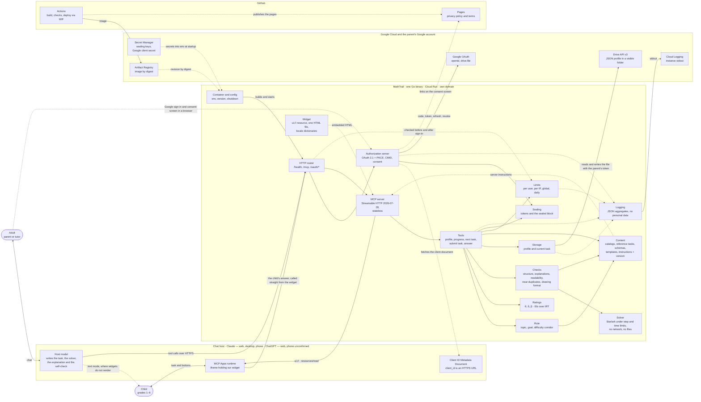

# 01. Context diagram

> Task T06 of [RUN.md](../../RUN.md). Sources: [PRODUCT-V1.md](../../PRODUCT-V1.md) sections 4–7 and 9; implementation decisions in [docs/decisions.md](../decisions.md); spike reports [T03](../live/01-spike-protocol.md) and [T04](../live/02-spike-oauth.md).

What the service is made of and what it talks to. Neither the child nor the adult talks to us: they talk to a chat host, and the **host's model** writes the task, the explanation and everything else the child reads. The service makes no LLM calls of its own (PRODUCT 4.3). MathTrail is one Go binary on Cloud Run behind its own domain: it picks the topic and the difficulty, hands the model a package to generate from, checks what the model submits, shows the task to the child in a widget without the answer, and keeps the ratings. Between requests it stores nothing — the sign-in state lives sealed inside the tokens the host holds, and the child's profile is a file in the parent's Google Drive (PRODUCT 5, 6).

## Diagram

**How to read it:**
- A solid arrow is a call or a request.
- A dashed arrow is a read of an embedded resource, a setting or a document — and, for `logs`, the events written to it.
- Inside the `MathTrail` box are components of one process, not separate services: between them are ordinary function calls.

## Outside the service

| Actor | Why it is on the diagram | PRODUCT |
|---|---|---|
| Adult — parent or tutor | Owns both the host account and the Google account: connects the app, signs in, creates the profile, watches the progress. Only the adult signs in through Google (О-22) | 3, 9.3 |
| Child | Solves tasks in the adult's chat; has no sign-in of their own | 3 |
| Host model | Writes the task, the solver, the explanation and the self-check, and runs the lesson in text mode. The service makes no LLM calls itself | 4.1, 4.3 |
| The host's MCP Apps runtime | Renders the widget in a sandboxed iframe, passes it the locale, the platform and the container size, and forwards tool calls made from the widget | 4.2, 9.3 |
| Client ID Metadata Document | Since 2026-07-28 the primary way a client registers: the `client_id` is an HTTPS URL, and our authorization server fetches the document from it (R03). DCR stays as a fallback | 9.3 |
| Google OAuth | The parent's sign-in, the `openid` and `drive.file` scopes, refresh and revocation | 6, 7, 9.3 |
| Google Drive API v3 | The only durable storage: a JSON profile in a visible folder of the parent's Drive (О-5) | 5, 7 |
| Secret Manager | Sealing keys and the Google client secret; versions are pinned and read once per instance start (О-7) | 6, 7 |
| Artifact Registry | The revision image by digest, with a cleanup policy for old images | 7 |
| Cloud Logging | Where the structured stdout of Cloud Run lands, and where the aggregates are counted from (О-16) | 6 |
| GitHub Actions | Build, checks, image publication and deploy through WIF, with no service-account keys | 7, 8 |
| GitHub Pages | Privacy policy and terms; the Google consent screen and the directories link to them (О-19) | 6, 7, 8 |

Platforms outside v1 are deliberately absent from the diagram: Gemini and DeepSeek are dropped by the "no widgets and no MCP" rule, and Mistral Le Chat, Perplexity and Microsoft 365 Copilot are not considered for v1 (О-9, PRODUCT 9.2).

## Components inside the binary

| Component | Responsibility | PRODUCT | RUN task |
|---|---|---|---|
| **HTTP router** | The single entry point of the process: `/health`, `/mcp`, the OAuth and `.well-known` endpoints. Timeouts, body size limit, `Origin` check, client address from the last hop of `X-Forwarded-For`, own domain as the issuer | 6, 7, 9.3 | T17, T41, T47 |
| **Authorization server** | We are our own OAuth 2.1 authorization server: resource and server metadata, CIMD with SSRF protection and DCR as a fallback, `/authorize` with a consent screen and a CSRF cookie, the Google sign-in, the callback, `/token`, refresh, revoke, and the bearer check on every request | 6, 7, 9.3 | T47–T49 |
| **MCP server** | The protocol: Streamable HTTP 2026-07-28, stateless, on go-sdk v1.8.0; `tools/list` and `tools/call`; the `ui://` resource with its MIME type and CSP; server `instructions` with their version. The set of supported protocol versions is not narrowed (R02) | 4.1, 4.2, 7, 9.3 | T41, T42 |
| **Tools** | The five capabilities of PRODUCT 4.1, plus the answer tool the widget calls directly (О-42). Every call is the same shape: read the profile, compute, write it back. Nothing secret and nothing internal ever goes into `structuredContent` (О-39) | 3, 4.1–4.4 | T43–T45 |
| **Rule** | The deterministic choice of a brief: after a failure, consolidate the same topic; otherwise a new topic not seen for a while; difficulty from the 70–85 % corridor. The hint, the pace, "I don't understand" and consecutive failures change nothing but this (О-33) | 4.3, 4.5 | T27 |
| **Ratings** | P = 0.2 + 0.8·σ(θ + δ − β), Elo updates with a decaying step, the corridor and the recommended β, the chess scale and the rank boundaries, the criterion for a mastered topic (О-32, О-48) | 4.5 | T25 |
| **Checks** | The pipeline a submitted task passes: structure and five distinct options, a trap and an explanation behind every wrong one, explanations distinguishable from each other (R10), readability for the grade, near-duplicates, the format of the text drawing and the match between its structural description and the wording (О-37) | 4.3 | T32–T35 |
| **Solver** | The Starlark sandbox: the model's program brute-forces the options and confirms that exactly one of them is correct. Step and time limits, no network, no files (О-8) | 4.3, 7 | T28 |
| **Content** | Everything embedded in the binary that is not code: the topic, trap and skill catalogs, the reference tasks, the JSON schemas, the solver templates (R08), the drawing frames (R09), the model instructions and their version (О-21). It builds the generation package and is validated at startup | 4.3, 4.6, 8 | T23, T36, T36a, T36b |
| **Widget** | The five screens of PRODUCT 4.2 plus the waiting screen (О-26): Preact bundled into one HTML file with no external loads, embedded in the binary. Locale dictionaries keyed by BCP 47 tags, a layout that works from 320 px, buttons sized for a finger | 4.2, 6, 7 | T42, T54–T57 |
| **Storage** | The profile interface and its two implementations, in memory and in the parent's Drive. Find or create the file, compare revisions, resolve a two-tab conflict, recover a corrupted file, export, handle revoked access, and stay inside the Drive call budget | 5, 7, 9.4 | T40, T50, T51 |
| **Sealing** | One mechanism doing two jobs: sealing the sign-in state and the Google tokens inside the tokens we hand out (О-7), and sealing the answer to the current task inside the profile file (О-25). Keys come from Secret Manager and rotate by key id | 4.4, 5, 6 | T24 |
| **Limits** | Per-user rate in the instance's memory, per-IP before sign-in, a global cap, and the daily limit of accepted tasks counted in the profile (О-15, О-35). Over the limit, a clear message the model relays into the chat | 6, 9.4 | T52 |
| **Logging** | Structured JSON with the Cloud Run keys, one aggregate per call: tool, outcome, rejection reason, duration, attempt count, limit hits, instructions version. No personal data, no task text, no answers (О-16, О-21) | 6 | T17, T41, T60 |
| **Container and config** | Wiring the dependencies and closing them in reverse order, the HTTP server with its timeouts and graceful shutdown, all configuration read from environment variables with `Validate()`, the build version, and the refusal to start with dev flags when `K_SERVICE` is set | 6, 7 | T17 |

### Why exactly these components

Thirteen of them are named in task T06 itself. Two more are here for a reason:

- **Sealing** is its own component because it has two unrelated consumers: the authorization server (О-7) and the tools that hide the answer to the current task (О-25). Hiding it inside either one would make the other depend on someone else's internals.
- **Container and config** exists because PRODUCT 6 — all configuration through environment variables, no database, no queues, no disks — otherwise belongs to nobody: it is a property of how the process starts, not of any of the thirteen parts.

What is absent from the diagram is part of the picture too, and stays absent in v1: a database and queues (PRODUCT 6), a session store (the protocol is stateless, О-20), a shared cache or Redis (О-24), a buffer of pre-generated tasks (О-6), an LLM API client (PRODUCT 4.3), a REST and OpenAPI layer (О-1), any rendering of real images (PRODUCT 2), a separate quality-evaluation harness (О-38) and the "advice for the adult" block (О-45, R11).

## Coverage of PRODUCT 4–7

The acceptance check for this task: every requirement in sections 4–7 belongs to at least one component. Rows follow the order of the document.

| Requirement | Components |
|---|---|
| 4.1 Profile: create, show, edit, return the recommendation | Tools, Storage, Rule |
| 4.1 Progress | Tools, Storage, Ratings |
| 4.1 Next task: the generation package | Tools, Rule, Content, Limits |
| 4.1 Submit task: check, store, hand out without the answer | Tools, Checks, Solver, Sealing, Storage |
| 4.1 Answer: record, update ratings, explain | Tools, Ratings, Storage, Sealing |
| 4.1 The model may change topic or difficulty only with a reason | Tools, Rule |
| 4.2 The five screens and the waiting screen | Widget |
| 4.2 The answer and the solution never reach the card before the child answers | Tools, Sealing, Widget |
| 4.2 An answer button calls the tool directly (О-42) | Widget, MCP server, Tools |
| 4.2 Phone first: from 320 px, large buttons, no horizontal scrolling | Widget |
| 4.2 One embedded file, CSP with no third-party domains | Widget, MCP server |
| 4.2 Any interface language: dictionaries by key, BCP 47 tags, the host's language, an override in the profile, fallback to the language without a region and then to English | Widget, Storage |
| 4.2 The layout uses the platform, the container size and the safe-area insets | Widget |
| 4.2 No answer and no internal fields in the structured result (О-39) | Tools |
| 4.2 Text mode is mandatory (О-10) | Tools, Content |
| 4.3 The brief is built by the rule | Rule |
| 4.3 The package: brief, reference tasks, trap catalog, prohibitions, formats, solver templates, drawing frames | Content, Rule, Tools |
| 4.3 Structure, a trap and an explanation behind every wrong option | Checks |
| 4.3 Explanations are distinguishable and do not retell the solution, the hint or the catalog (О-46) | Checks |
| 4.3 A Starlark solver finds exactly one correct option, under limits and with no network | Solver |
| 4.3 The model's self-check against a checklist | Content (the checklist), Checks (its presence and structure), the host model |
| 4.3 Readability for the grade | Checks |
| 4.3 No near-duplicate among the child's earlier tasks and the reference tasks | Checks, Storage (fingerprints) |
| 4.3 Text drawing: format, checked by the program | Checks |
| 4.3 Text drawing: meaning by the model's self-check, structure by comparison (О-37) | Checks, Content, the host model |
| 4.3 Text drawing: rendering, settled by a live test | Widget (calibrated in T58) |
| 4.3 Up to three attempts per request | Tools, Storage |
| 4.3 An accepted task becomes the current one; the draft is never shown to the child | Tools, Storage, Widget |
| 4.4 No pre-generated tasks | Tools (there is no buffer component) |
| 4.4 One current task, kept in the profile file until it is answered | Storage |
| 4.4 The answer lives in a sealed block, encrypted with the service key (О-25) | Sealing, Storage |
| 4.4 The host's tool-call log is out of the threat model (О-27) | Outside the service: the host UI; described in the privacy policy (T19) |
| 4.4 The waiting screen and the warm-up (О-26) | Widget |
| 4.5 P = 0.2 + 0.8·σ(θ + δ − β), Elo updates, the 0.70–0.85 corridor | Ratings |
| 4.5 The chess scale and a rank above the number (О-48) | Ratings, Widget |
| 4.5 Hint, pace, "I don't understand" and consecutive failures do not change the rating (О-33) | Ratings, Rule |
| 4.5 A mastered topic is decided automatically and deterministically (О-32) | Ratings |
| 4.5 β is barely calibrated in v1 | Ratings |
| 4.6 Catalogs, reference tasks, schemas, templates, frames and instructions embedded in the binary | Content |
| 4.6 The instructions version is logged with every result (О-21) | Content, Logging |
| 4.6 Topics for grades 5–6 and the brute-forceable subset of geometry (О-30) | Content |
| 4.6 The task is written in the chat's language, stored as a BCP 47 tag | Tools, Storage |
| 4.6 No real contest tasks; the wording is our own | Content |
| 5 The service stores nothing between requests | Container and config, Sealing, Limits (instance memory only) |
| 5 Profile and current task: a JSON file in a visible Drive folder, `drive.file` scope | Storage |
| 5 Profile contents: schema version, UUID, pseudonym, grade, interests, constraints, language, ratings, history, counter, current task | Storage, Ratings, Tools |
| 5 Losing the profile is unacceptable: two tabs, a corrupted file, export, revoked access | Storage |
| 5 Pseudonym only, and it never reaches the task text (О-36) | Tools (field validation), Content (the instruction that states it) |
| 5 Free-form notes go only into the model's package, with a length cap (О-31) | Tools, Content |
| 5 The file size is bounded: a history window plus a summary (О-5, О-40) | Storage |
| 6 One binary, stateless, configured through environment variables | Container and config |
| 6 $0 within the free tier, with a budget alert | Outside the service: Cloud Run and the budget (T20); inside: Limits |
| 6 Limits: per-user rate, per-IP before sign-in, global, daily, with a clear message | Limits |
| 6 Free chat tiers: the scenario fits their message limits | Widget (a button costs no model turn), Tools (one generation per task) |
| 6 Phones first: 320 px, finger-sized buttons, a drawing that fits the width | Widget, Checks |
| 6 Tools answer in under a second, Drive aside | Tools, Rule, Ratings, Checks, Solver (pure computation); Storage (the only network call) |
| 6 OAuth 2.1 with PKCE, short-lived tokens, a token check on every request | Authorization server, HTTP router |
| 6 OAuth state and Google tokens are not stored but sealed into tokens; the key lives in Secret Manager (О-7) | Sealing, Container and config |
| 6 No secrets in the repository | Container and config (env only); outside: the `gitleaks` step in CI (T18) |
| 6 Minimal data, logs without personal data and without task text or answers | Logging |
| 6 Privacy policy and terms are published | Outside the service: GitHub Pages (T19) |
| 6 Observability: aggregates in the logs — outcome, rejection reason, time, attempts, limit hits, instructions version (О-16) | Logging, Content |
| 7 Go, one binary, exact versions | Container and config |
| 7 MCP Streamable HTTP 2026-07-28, stateless, go-sdk v1.8.0 (R01, R02) | MCP server |
| 7 MCP Apps 2026-01-26 and Preact, one HTML file inside the binary (О-13) | Widget, MCP server |
| 7 starlark-go, embedded in the binary | Solver |
| 7 Google Drive API v3 | Storage |
| 7 OAuth 2.1 + PKCE, Google sign-in, the service as the authorization server | Authorization server |
| 7 Secret Manager: the sealing key and the client secret through environment variables | Container and config, Sealing |
| 7 OpenAPI is not used (О-1) | Deliberately no component |
| 7 Docker, Cloud Run, own domain, Artifact Registry, GitHub Pages | Outside the service: T20–T22; inside: HTTP router (own domain as the issuer) |

## What crosses the service boundary

- **Only tool results go out to the host model:** the child's profile (pseudonym, grade, interests, constraints, notes), the brief, the reference tasks, the catalogs and the task text. No personal data about the child is there by construction — only the pseudonym (PRODUCT 5). The structured result is assumed to land in the model's context in full, so internal fields and the answer are never in it (О-39).
- **The answer to the current task does not leave** before the child answers: it sits sealed in the profile file and reaches neither the widget nor the model's plain text (О-25). One exception is stated openly: the model wrote the task and its answer itself, so the adult will see both in the host's tool-call log — that is outside the threat model (О-27).
- **Only the parent's own requests go to Google:** a sign-in with the `openid` and `drive.file` scopes, and reading and writing one file with the parent's own token. We hold no service-level access to anybody's files.
- **We go nowhere else ourselves:** no LLM API, no third-party services. The one outbound request that is not to Google is fetching the Client ID Metadata Document over HTTPS — which is exactly why it gets its own SSRF protection (T47).
- **Untrusted model code never leaves the sandbox:** the Starlark solver has no network, no files and no time beyond its limit (О-8).
- **Nothing personal reaches the logs:** aggregates only — tool, outcome, rejection reason, duration, attempts, instructions version (О-16).

## Notes for PRODUCT/SPEC

Found while drawing the diagram. Each is a question for SPEC rather than for PRODUCT: none of them changes a product decision, so none is raised as an open question in 12.2.

1. **Where the authorization server and the limits live.** The package layout in [CLAUDE.md](../../CLAUDE.md) puts the OAuth endpoints in `internal/transport/http`, while the tasks call them `internal/oauth` (T47) and `internal/ratelimit` (T52) — the latter is not in the layout at all. Drive storage is called both `internal/store/drive` (T50) and `infra/drive` (the layout). On this diagram they are the same components either way, but SPEC has to settle on one name each. **For:** T15 and T17.
2. **The language of server-rendered pages.** PRODUCT 4.2 describes languages for widgets only. The OAuth consent screen is server-rendered HTML, and T48 gives it just two dictionaries, `en` and `ru`, selected by `Accept-Language`. That is a deliberate simplification, but PRODUCT does not say so, and section 4.2 reads as the opposite. **For:** T15, which should state the rule: all locales in the widget, `en` and `ru` on server-rendered pages.
3. **One sealing key or two.** О-7 speaks of a key for the tokens, О-25 of a key for the task answer, and nothing says whether they are the same key. The difference shows up immediately: a token lives for minutes and survives any rotation, while the sealed block sits in the parent's Drive and must still be readable after the key changes. **For:** T07 (the token table and rotation) and T09 (the format of the sealed block).
4. **The Cloud Run address as a second entrance.** PRODUCT 7 requires an own domain and says the Cloud Run address is not shown to users as the main one — but the service stays reachable at it. The diagram shows the domain as the issuer, and SPEC has to say what the service does with a request that did not arrive on its own domain: serve it, refuse it, or merely withhold the metadata for it. **For:** T07, T15.
5. **Where the locale dictionaries live.** PRODUCT 4.6 lists the embedded content and does not mention the interface dictionaries, while 4.2 requires that "a new language is a new dictionary file, with no change to the code". On this diagram they sit inside the Widget component, that is, inside the bundled HTML — which would make a new language a widget rebuild rather than just a new file. **For:** T14 and T54, which decide whether the dictionaries belong to the widget bundle or to `content/` and are served separately.
6. **Cloud Logging is not named in PRODUCT 7.** The technology table lists Cloud Run, Secret Manager and Artifact Registry but not the log sink, even though the О-16 aggregates are read from it and the T60 metrics are counted there. One row in the PRODUCT 7 table is enough. **For:** T15, or the next edit to PRODUCT.
