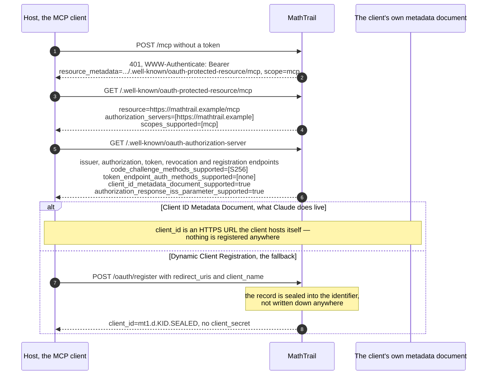
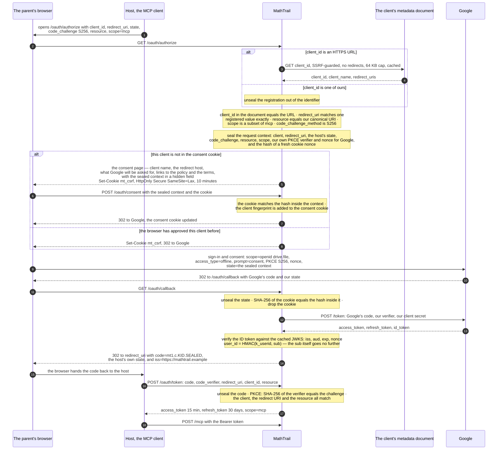
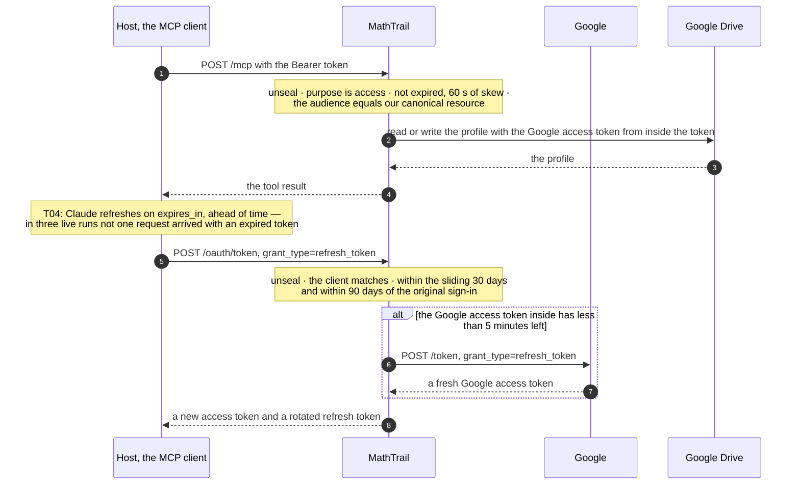
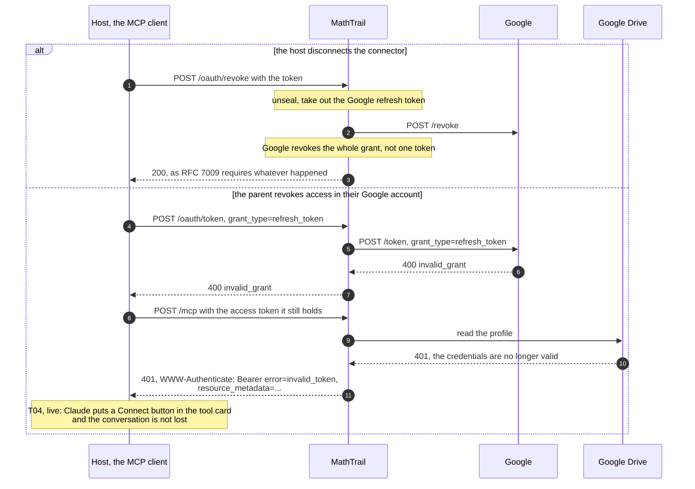

# 02. Sign-in and tokens

> Task T07 of [RUN.md](../../RUN.md). Sources: [PRODUCT-V1.md](../../PRODUCT-V1.md) sections 5, 6, 7 and 9.3 (О-7, О-22); implementation decisions [R03 and R04](../decisions.md); the live spike report [T04](../live/02-spike-oauth.md); the MCP authorization specification 2026-07-28; the Google OAuth 2.0 and OpenID Connect documentation. Implemented in T47–T49; SPEC writes it up in T15.

The parent signs in once and two things follow: the chat host gets a token for our MCP endpoint, and we get permission to keep one JSON file in the parent's Google Drive. Between those requests **the service stores nothing** — no sessions, no client registrations, no Google tokens (PRODUCT 5, 6). Everything that a stateful authorization server would put in a database lives here in one of three places: sealed inside a token the host holds, sealed inside a cookie the parent's browser holds, or in Google. The child never signs in; only the adult does (О-22).

In the examples the service's own domain is written `https://mathtrail.example` — the real one is registered in T20–T22 (О-19).

## Checked against the sources

Written against the documents, not from memory (CLAUDE.md, "How we work"), all read on 2026-09-20:

- **MCP authorization 2026-07-28** — `basic/authorization/{index,authorization-server-discovery,client-registration,security-considerations}.mdx` from the `modelcontextprotocol/modelcontextprotocol` repository. What it pins for us: RFC 9728 protected resource metadata is mandatory; an authorization server must offer RFC 8414 or OpenID Connect discovery; Client ID Metadata Documents are the primary registration path and DCR is deprecated but retained; the `resource` parameter of RFC 8707 is mandatory in both the authorization and the token request; `iss` in the authorization response is SHOULD, and a server that sends it must advertise `authorization_response_iss_parameter_supported`; PKCE S256; exact redirect URI matching; refresh token rotation for public clients; SSRF, confused-deputy and open-redirect requirements.
- **The live behaviour of Claude** — the T04 spike: CIMD used for real (`client_id: https://claude.ai/oauth/mcp-oauth-client-metadata`), the exact canonical `resource`, refreshes driven by `expires_in` rather than by a 401, a full automatic step-up on HTTP 403, and a "Connect" button in the tool card when every token is gone. ChatGPT is still unverified — its column in the T04 matrix is empty until T63.
- **Google OAuth 2.0 for web server applications** and **Google OpenID Connect**, plus the live discovery document at `https://accounts.google.com/.well-known/openid-configuration`: authorization endpoint `https://accounts.google.com/o/oauth2/v2/auth`, token endpoint `https://oauth2.googleapis.com/token`, revocation endpoint `https://oauth2.googleapis.com/revoke`, JWKS at `https://www.googleapis.com/oauth2/v3/certs`, `code_challenge_methods_supported: ["plain", "S256"]` — so PKCE works towards Google too. Three facts shape the design below: a refresh token "is only returned on the first authorization" unless `prompt=consent` is sent; revoking any token revokes the whole grant ("If the token is an access token and it has a corresponding refresh token, the refresh token will also be revoked"); and there is a limit of 100 refresh tokens per Google Account per OAuth client ID, past which the oldest is invalidated silently.
- **The go-sdk v1.8.0 helpers** we build on (R01), verified with `go doc`: `auth.ProtectedResourceMetadataHandler`, `auth.RequireBearerToken` with `RequireBearerTokenOptions{ResourceMetadataURL, Scopes, ClockSkew}`, `auth.TokenVerifier` returning `auth.TokenInfo{Scopes, Expiration, UserID, Extra}`, and `oauthex.MatchesResource` for the audience comparison.

## Roles and endpoints

One process wears two hats: it is the **authorization server** the host signs in against, and the **resource server** the host then calls. Towards Google it wears a third: an ordinary OAuth **client**.

| Path | Method | What it does | Auth |
|---|---|---|---|
| `/.well-known/oauth-protected-resource/mcp` | GET | RFC 9728 metadata for the resource `https://mathtrail.example/mcp` — the path-suffixed form a client tries first | public |
| `/.well-known/oauth-protected-resource` | GET | the same document at the root — the fallback in the client's probing order | public |
| `/.well-known/oauth-authorization-server` | GET | RFC 8414 metadata; the issuer has no path component, so this one URL is enough | public |
| `/oauth/register` | POST | RFC 7591 registration, kept as the fallback for a host without CIMD (R03); stateless — the record is sealed into the `client_id` itself | public |
| `/oauth/authorize` | GET | validates the client, the redirect URI, PKCE, `resource` and `scope`; shows the consent screen or goes straight on to Google | the parent's browser |
| `/oauth/consent` | POST | the parent's approval of this client; the only thing it adds is a cookie entry | CSRF cookie |
| `/oauth/callback` | GET | Google's redirect target: verifies the state and the cookie, exchanges Google's code, issues **our** code | CSRF cookie |
| `/oauth/token` | POST | `authorization_code` and `refresh_token` | PKCE / the refresh token |
| `/oauth/revoke` | POST | RFC 7009; revokes the grant at Google | the token itself |
| `/mcp` | GET, POST | the protected resource | Bearer |
| `/health` | GET | liveness; the only path served on any `Host` | public |

Two things are deliberately absent. There is no user-facing account page — we have no accounts, only Google's. And there is no session cookie: the consent cookie remembers an approval, nothing else, and losing it costs one extra screen.

## Signing in, step by step

### 1. Discovery and client registration

The 401 challenge carries `resource_metadata` and `scope`, so a host never has to guess either. We serve the well-known documents as well, because the specification requires a client to be able to fall back to probing them.

A DCR `client_id` is the registration: unsealing it yields the redirect URIs and the client name. Nothing is stored, and there is nothing to garbage-collect. If the key ring has moved on so far that the identifier no longer unseals, the answer is `invalid_client` and the host registers again — one unauthenticated POST.

We accept **public clients only**: `token_endpoint_auth_methods_supported` is `["none"]`, and we issue no client secrets. A client document that declares `private_key_jwt` is still accepted, and still treated as public; our metadata says plainly what we support. T04 also found that Claude's document lists a `grant_types` entry we do not implement (`urn:ietf:params:oauth:grant-type:jwt-bearer`) — an extra grant in a document is not a reason to reject the client, only a reason for `/oauth/token` to answer `unsupported_grant_type` if it is ever used.

### 2. The parent signs in

**Why the consent page exists.** We proxy a sign-in to a third party, which is the textbook confused-deputy setup: without a screen of our own, a stranger's client could ride on a browser that is already signed in to Google and never be seen by the parent. So a client the browser has not approved gets one page before Google is involved at all, and the page names the client and the **hostname of its redirect URI** — the specification asks for the hostname specifically, because a client name is only a string the client chose for itself. A `localhost`-only redirect URI gets an extra warning line: the metadata document cannot prove who is listening on a loopback port.

**Why `prompt=consent` on every sign-in.** Google returns a refresh token only on the first authorization, and a stateless service has nowhere to keep one from last time. Sending `prompt=consent` makes every sign-in yield its own refresh token. The costs are honest and worth writing down: the parent sees Google's permission screen on every connection, and the account's 100-refresh-token ceiling means that after a hundred sign-ins the oldest grant dies without a warning. Both belong in the privacy policy and the first-sign-in description (T19).

**Why the state is sealed and the cookie is not.** The sealed state is the authoritative copy of the request: it survives in a URL that goes through Google, which is exactly where a cookie cannot go. The cookie is a bare random nonce whose hash sits inside that state, and it proves one thing — that the browser finishing the sign-in is the browser that started it. If cookies are blocked entirely, the sign-in fails with a plain message rather than half-working.

**What `/authorize` checks, and in what order.** The order matters, because everything before the redirect URI is validated has to fail without redirecting anywhere:

1. `response_type=code`, and `code_challenge` with `code_challenge_method=S256` — a request without PKCE is refused rather than downgraded.
2. The client resolves: an HTTPS `client_id` with a path is fetched as a metadata document and must name itself; one of our own identifiers is unsealed. Anything else is `invalid_client`.
3. `redirect_uri` matches one registered value by exact string comparison.
4. `resource`, if present, is our canonical URI `https://mathtrail.example/mcp`, compared as `oauthex.MatchesResource` does it — byte-equal apart from a trailing slash. A mismatch is `invalid_target`. If the client sent none, we record our own canonical URI and log it: T04 showed Claude always sends it, and ChatGPT has not been watched yet.
5. `scope` is empty or `mcp`; anything else is `invalid_scope`.

Whatever is recorded in step 4 becomes the audience of the tokens issued from this request, and is what the bearer check compares against on every later call — that is the whole of the `resource` → `aud` binding RFC 8707 asks for, and the reason a token issued for somebody else's server cannot be spent on ours.

**Errors.** Until the redirect URI has been matched exactly, nothing is redirected anywhere: a bad `client_id` or a bad `redirect_uri` renders an error page. After it matches, errors go back to the client as an OAuth error response with `state` and `iss`, including the parent declining at Google, which comes back as `access_denied`.

### 3. Calling tools, and refreshing

The Google access token rides inside our access token; the Google **refresh** token does not — it lives only in our code and our refresh token. That is the one asymmetry worth remembering: a stolen access token buys minutes of Drive access to a single file, and no way to renew it.

The widget has no sign-in of its own. When the child presses an answer button, the call goes out through the host's MCP Apps runtime (О-42), and the host attaches the same bearer token it uses for every other call — the iframe never sees a token, and there is no second authorization path to secure.

### 4. Revoking, and losing access at Google

Two consequences to state out loud. First, a stateless server cannot invalidate a token it has already issued, so a revoke that touched only our own tokens would be theatre; revoking at Google is the only thing that actually ends access, and it ends the **whole** grant — if the parent has the app connected in two hosts, disconnecting one disconnects both. Second, a Google token that has been revoked leaves our own token cryptographically valid but useless, so a Drive `401` is translated into a `401` of ours with a `WWW-Authenticate` challenge: the host then starts a new sign-in on its own.

## Tokens and cookies

Everything below is opaque to the client: a purpose tag, a key id and one AEAD ciphertext, `mt1.
.<kid>.<base64url>`. Nothing is a JWT — nobody but us ever has to read one, and an opaque string cannot leak claims into a log.

| What | What is inside | Sealed with | Lives for | Where it is kept |
|---|---|---|---|---|
| Authorization code `mt1.c.` | user id, Google refresh token, Google access token and its expiry, client id, exact redirect URI, `code_challenge`, resource, scope, issued-at, random id | purpose `code` | 60 s | in the redirect URL, then in the host's memory |
| Access token `mt1.a.` | user id, client id, resource (the audience), scope, Google access token and its expiry, issued-at, expiry | purpose `access` | 15 min, and never past the Google token inside it minus 60 s | the host's token store |
| Refresh token `mt1.r.` | user id, client id, resource, scope, Google refresh token, Google access token and its expiry, the original sign-in time, issued-at, expiry | purpose `refresh` | 30 days sliding, at most 90 days from the original sign-in | the host's token store |
| DCR registration, the `client_id` itself `mt1.d.` | redirect URIs, client name, created-at | purpose `client` | as long as the key that sealed it is still loaded | the host's client store |
| The request context, our `state` towards Google `mt1.s.` | client id, redirect URI, the host's own `state`, `code_challenge` and method, resource, scope, our PKCE verifier and nonce for Google, the hash of the cookie nonce, issued-at | purpose `state` | 10 min | the URL at Google, and the parent's browser |
| CSRF cookie `mt_csrf` | 32 random bytes, nothing else | not sealed — it is compared by hash | 10 min | the parent's browser, HttpOnly Secure SameSite=Lax, path `/oauth` |
| Consent cookie `mt_consent` `mt1.k.` | the fingerprints of approved clients, `SHA-256(client_id + redirect_uri)`, and when each was approved | purpose `consent` | 180 days | the parent's browser, HttpOnly Secure SameSite=Lax, path `/oauth` |
| The sealed block of the current task | the answer, the trap texts, the solution, the solver code (О-25) | purpose `task-answer` | until the task is answered or the key that sealed it is retired | the profile file in the parent's Drive (T09) |
| Google's own tokens | — | — | Google's rules: a refresh token dies after six months unused, on a revocation, or past the 100-token ceiling | only inside the rows above; never on our side |

The lifetimes in one place, with the reason each was chosen:

| Constant | Value | Why |
|---|---|---|
| Authorization code | 60 s | a stateless server cannot mark a code as used, so the window is made small instead |
| Access token | 15 min | short enough that a stolen token is a small loss, long enough that refreshes are rare; re-sealing one costs no call to Google |
| Google access token refreshed early | under 5 min left | so the host is never handed a token that expires in two minutes |
| Refresh token, sliding | 30 days | a connector in weekly use never has to sign in again |
| Refresh token, absolute | 90 days from the sign-in | without reuse detection this is the only ceiling on a stolen refresh chain; it also matches the key rotation period |
| The request context and its cookie | 10 min | the length of one sign-in, including Google's own screens |
| Consent cookie | 180 days | approving the same host on the same browser twice a year is not a burden |
| CIMD cache | the document's own cache headers, floor 5 min, ceiling 24 h | the specification asks for cache headers to be respected; the floor keeps a burst of sign-ins from becoming a burst of fetches |
| Clock skew allowed | 60 s | Cloud Run instances and Google are not perfectly in step |
| Key rotation | 90 days, the previous key kept for one period | two live keys, so no token and no sealed task dies in a rotation |

## Sealing and the key ring

**One AEAD, one key ring, separate purposes.** Sealing is XChaCha20-Poly1305 with a random 192-bit nonce — with several instances and no shared state, a nonce space that large removes nonce management as a thing to get wrong. Each key ring version is 32 random bytes in one Secret Manager secret; the key id is derived from the key itself (the first six base64url characters of its SHA-256), so a key and its id can never be configured apart. Per-purpose subkeys come from HKDF-SHA256 with the info string `mathtrail/v1/<purpose>`, and the purpose and key id are also the additional authenticated data. The effect is that a ciphertext made for one purpose cannot be unsealed as another: an access token cannot be presented as a refresh token, and a sealed task answer cannot be fed in as a `client_id`.

**Rotation.** Two keys are loaded at a time: the current one seals and unseals, the previous one only unseals. Each is a pinned Secret Manager version delivered in its own environment variable, read once when the instance starts (PRODUCT 7). Rotating means adding a version, moving current to previous, deploying, and only then disabling the version that fell off the end — at most three active versions per secret, inside the free tier's six. Because the key id travels in every token, a rotation is invisible: tokens sealed by the previous key keep working until they expire on their own.

**This answers the question T06 left open — one sealing key or two.** О-7 speaks of a key for the tokens and О-25 of a key for the task answer, and the honest objection was that their lifetimes differ: a token lives minutes, while a sealed answer sits in the parent's Drive and must still be readable later. One key ring with separate purposes handles both, as long as one degradation is accepted: a task left unanswered across two rotations — six months — can no longer be unsealed, and the tool then tells the model that this task can no longer be checked and clears it so the child gets a new one. Losing an abandoned six-month-old task costs nothing; a second secret with its own rotation schedule, its own configuration and its own way to be misconfigured costs more. T09 fixes the format of that sealed block and T24 implements the sealer.

**If a key leaks**, the same machinery is the response: publish a new version as current and drop the leaked one from the deployment in the same step. Every token sealed with it stops working at once, every host signs in again, and the only real loss is the sealed answers of tasks in flight — the tasks are re-issued. The key itself never appears in a log; only its id does.

## The identifier used for limits

The per-user limits of PRODUCT 6 need a stable identifier, and Google's `sub` must not become it — it is a Google-wide identifier for a real person, and it has no business sitting in our aggregates.

`user_id = base64url(HMAC-SHA256(k_userid, "google-sub:" + sub))` truncated to 16 characters, with `k_userid` derived from the key ring like any other purpose. It is computed once, in the callback handler, and sealed into the code and from there into every token; the `sub` itself is discarded in that same handler and never reaches a token, a log or the profile.

Because it is carried rather than recomputed, a key rotation cannot change the identifier under a live session — only the next fresh sign-in produces a new one. What that costs: the in-memory rate-limit buckets for a returning parent start empty (they live for minutes anyway, and the daily counter of accepted tasks lives in the profile file, not here), and log aggregates cannot be tied together across a rotation, which is a property О-16 does not ask for. What it constrains: nothing durable may be keyed by this identifier — in particular the Drive file lookup in T10 must not be, or a rotation would orphan profiles.

## Scopes

Our own scope set is one scope, `mcp`, advertised in `scopes_supported` and in the 401 challenge. Towards Google we ask for exactly two: `openid`, for a verified `sub` in the ID token, and `https://www.googleapis.com/auth/drive.file`, the per-file scope that needs no restricted-scope review (PRODUCT 9.3). Google's scopes are never visible to the host: the host's token is ours, and it is about our resource.

With one scope, no tool can ever answer `insufficient_scope`, so v1 issues no step-up challenge. If a later version ever needs one, R04 already settled how: HTTP 403 with a `WWW-Authenticate` header — Claude completes the whole step-up on that, automatically, while the `_meta["mcp/www_authenticate"]` route alone is ignored — with `_meta` added alongside for ChatGPT, never instead. Tools still carry the `securitySchemes` annotation in `_meta` so a host can see what they require (T41, T47).

## Requests that do not arrive on our own domain

T06 left this open too. The issuer, the canonical resource and every absolute URL we emit come from configuration (`MATHTRAIL_PUBLIC_URL`), never from the `Host` header. The T04 spike did the opposite, deriving the issuer per request, for one reason that does not apply in production: a `trycloudflare.com` subdomain is unknown when the process starts.

A Cloud Run service stays reachable at its `run.app` address even when a custom domain is in front of it, so the rule is: `/health` answers on any `Host`, because the platform's own probes use that address; every other path answers `404` with an empty body when the `Host` is not our domain, and one counter in the log records it. This is not a security boundary — a token's audience is checked against the configured canonical resource anyway, so a token obtained at the wrong entrance would not be honoured — it is about there being exactly one issuer and one set of metadata. Where Cloud Run's "disable default URL" setting is available, T20 turns the second entrance off at the platform level as well.

## Where the state lives

The acceptance question for this task is whether one can see that the server stores nothing. This table is the answer: every piece of state a stateful authorization server would own, and where ours is instead.

| State | Where it lives | How long |
|---|---|---|
| Client registration | the client's own metadata document, or sealed into the `client_id` we issued | not ours to keep |
| Consent given to a client | the sealed `mt_consent` cookie in the parent's browser | 180 days |
| The in-flight authorization request | the sealed `state` in the URL, bound to a nonce cookie | 10 min |
| The PKCE verifier and nonce we use towards Google | inside that same sealed `state` | 10 min |
| Google's access and refresh tokens | sealed inside our code, access and refresh tokens, held by the host | their own lifetimes |
| The signed-in session | the host's token store; we hold no session at all | at most 90 days |
| The user identifier for limits | inside the tokens; derived, never stored | with the token |
| The child's profile and the current task | a JSON file in the parent's Google Drive (О-5) | until the parent deletes it |
| Sealing keys | Secret Manager, read into the instance once at startup | the version's lifetime |
| Rate-limit counters | the instance's memory (О-15, О-24) | minutes |
| CIMD documents and Google's JWKS | the instance's memory cache | their cache headers |

Restart the service, or start a second instance, and nothing above is lost or has to be synchronised. That is the whole reason the design looks like this.

## Threats and defences

| Threat | What we do | What remains |
|---|---|---|
| **Replaying an authorization code** — with no store, a code cannot be marked as used | 60 s lifetime; the code is bound to the client, to the exact redirect URI, to the `resource` and to the PKCE challenge, so redeeming it requires the verifier, which only the real client has | a client that leaks both its code and its verifier inside the same 60 s can have them replayed. Rejected: an in-memory set of used codes — with several instances it guarantees nothing (О-24) and still has to be maintained |
| **Token theft** | HTTPS everywhere; tokens never in a URL, never in a log, never in a widget payload; a 15-minute access token that carries no Google refresh token; refresh tokens rotated on every use, sliding for 30 days and capped at 90 from the sign-in; revoking at Google kills the grant | reuse of a stolen refresh token cannot be detected statelessly, so it works until one of those ceilings or a revocation ends it |
| **A leaked sealing key** — every token becomes forgeable and every sealed answer readable | rotate the key ring: the new version becomes current and the leaked one is dropped in the same deployment, so every existing token dies at once; the key lives only in Secret Manager and in the revision's environment, and only its id is ever logged | tasks in flight lose their sealed answers and are re-issued |
| **SSRF through a Client ID Metadata Document** — we fetch a URL an unknown client chose | HTTPS with a path component only; we resolve the name ourselves and refuse private, loopback, link-local, unique-local and multicast addresses and the metadata address `169.254.169.254`; we dial the address we validated; no redirects are followed; a 64 KB body cap, a 10 s timeout with one retry (T04: the first resolution in a process can be slow); the result is cached; `client_id` in the document must equal the URL | a client hosted on a public address that later becomes internal — unlikely, and bounded by the cache's ceiling. No domain allow-list: any host must be able to connect, and the consent screen is the human check |
| **Open redirect** | exact string matching of `redirect_uri` against the registered list, with no prefixes and no wildcards; before that match nothing is redirected, errors render as a page; `iss` on every authorization response, including errors | — |
| **Confused deputy** — a stranger's client riding a browser already signed in to Google | our own consent screen before Google for any client this browser has not approved; the screen names the client and its redirect hostname, with an extra warning for `localhost` | a parent who approves without reading. The screen keeps the decision theirs, which is all a screen can do |
| **Mix-up between authorization servers** | `iss` in every authorization response and `authorization_response_iss_parameter_supported: true` in the metadata (RFC 9207) | — |
| **CSRF on the callback** | the `mt_csrf` cookie nonce bound by hash into the sealed `state`; no cookie, or a mismatch, and the callback refuses without redirecting | a browser that blocks cookies cannot sign in, and is told so |
| **Audience confusion, token pass-through** | the audience is checked on every request against the configured canonical resource with `oauthex.MatchesResource`; Google's token never reaches the host, and a token we did not seal cannot be unsealed at all | — |
| **Abuse of the endpoints open before sign-in** | per-IP limits on `/oauth/authorize`, `/oauth/token` and `/oauth/register`, the CIMD cache, and body and time caps on every fetch (T52) | the per-instance counting of О-24 applies here too |
| **Secrets in the logs** | the fields are fixed: client id, redirect URI, resource, requested and granted scope, key id, outcome and the derived user id — never a token, a code, a verifier, a cookie, an ID token, a `sub` or an email address (О-16) | — |

One methodological point carries over from T04 and applies to every acceptance run that touches sign-in: the model never sees any of this. A step-up, a refresh, a 401 and a retry all happen between the host and us, and in the model's context there is a single successful call. The server log is the only trustworthy account of what happened.

## Coverage of PRODUCT 6 and 9.3

| Requirement | Where it is in this document |
|---|---|
| 6 OAuth 2.1 with PKCE | "The parent signs in": `code_challenge_method=S256` required at `/oauth/authorize`, verified at `/oauth/token`; `code_challenge_methods_supported: ["S256"]` in the metadata |
| 6 Short-lived tokens | "Tokens and cookies": 60 s for a code, 15 min for an access token, with a 90-day ceiling on a refresh chain |
| 6 A token check on every request | "Calling tools": `auth.RequireBearerToken` with our verifier — unseal, purpose, expiry with skew, audience |
| 6 The OAuth state and the Google tokens are not stored on the server (О-7) | "Where the state lives" — every row is a cookie, a token, Google or Drive |
| 6 The encryption key lives in Secret Manager (О-7) | "Sealing and the key ring": pinned versions in environment variables, read once at startup |
| 6 No secrets in the repository | the Google client secret and the sealing keys are environment variables only; the repository holds neither |
| 6 Per-user limits keyed by the sign-in token | "The identifier used for limits" |
| 6 Several instances, nothing shared (О-24) | "Where the state lives"; the per-instance caveats are named in the threat table |
| 6 Logs without personal data | the threat table's last row; the `sub` never leaves the callback handler |
| 9.3 The client discovers the protected resource metadata and the authorization server metadata | diagram 1, and both well-known paths in the endpoint table |
| 9.3 Registration by CIMD, DCR or a pre-issued client | diagram 1: CIMD is primary (R03), DCR is stateless and kept as the fallback, a pre-issued client needs nothing from us |
| 9.3 The authorization code flow with PKCE | diagram 2 |
| 9.3 Only the adult signs in (О-22) | the opening paragraph: there is one Google sign-in and it is the parent's |
| 9.3 `drive.file` as a non-sensitive scope | "Scopes" |
| 9.3 Google's revocation and the six-month refresh token rule | diagram 4 and the token table |
| 5 The answer to the current task stays sealed (О-25) | "Sealing and the key ring": purpose `task-answer` on the same key ring, with its degradation rule |
| 7 The service is its own authorization server, state in encrypted tokens | the whole document |

## Notes for PRODUCT/SPEC

Found while designing the flow. None of them changes a product decision, so none becomes an open question in PRODUCT 12.2; each is work for a later task.

1. **Google's permission screen appears on every sign-in.** `prompt=consent` is what guarantees a refresh token for a server that keeps nothing, and the price is a screen the parent sees each time they connect a host. PRODUCT 3 describes the first sign-in as a single step. **For:** T19, which has to describe it, and T15.
2. **A hundred sign-ins is a real ceiling.** Google keeps at most 100 refresh tokens per account per client, and issues a new one each time we force consent; past the ceiling the oldest grant dies silently, which looks to the parent like one host spontaneously asking to reconnect. **For:** T15 and the troubleshooting text in T19.
3. **Revoking is a full disconnect.** Google revokes the whole grant, not one token, so disconnecting the connector in one host also disconnects the other. A stateless server has no better option — its own tokens cannot be invalidated. **For:** T15 and T19.
4. **The absolute 90-day session ceiling cannot be observed in an acceptance run** — it is a unit test in T49, or nobody will ever notice it is wrong.
5. **Nothing durable may be keyed by the derived user identifier.** It changes at the first sign-in after a key rotation. In particular the Drive file lookup in T10 must be keyed by the file's own `appProperties`, not by this. **For:** T09, T10.
6. **The `jwks_uri` quirk from T04 is still open.** `oauthex.AuthServerMeta` serialises the field as an empty string rather than omitting it; RFC 8414 does not require it for opaque tokens. Harmless as far as anyone has seen, but it has not been verified in ChatGPT. **For:** T47, and re-checked in T63.
7. **The consent screen is a security requirement, not a courtesy.** PRODUCT 6 lists PKCE, short-lived tokens and a check on every request, and says nothing about consent; the MCP specification requires it of any server that proxies a sign-in to a third party. **For:** T15, which should carry it into SPEC as a requirement rather than a detail of the implementation.
8. **Two of T06's open notes are closed here:** one key ring with separate purposes rather than two keys (its note 3), and configuration rather than the `Host` header as the source of the issuer, with `404` on any other host (its note 4).
