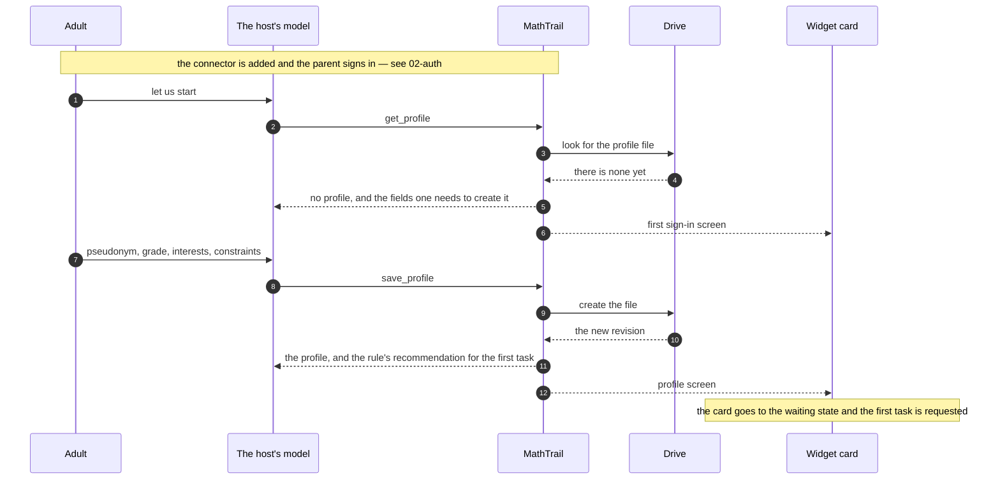
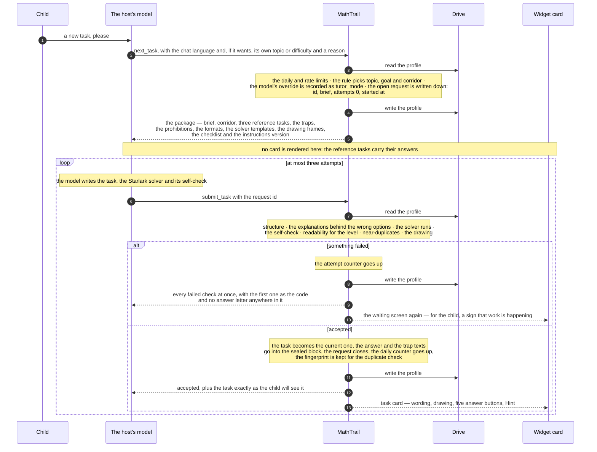
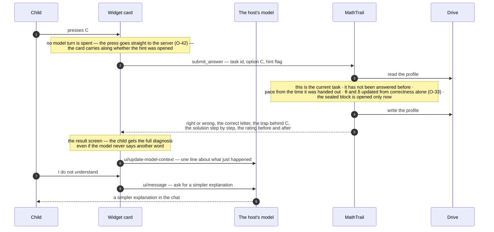
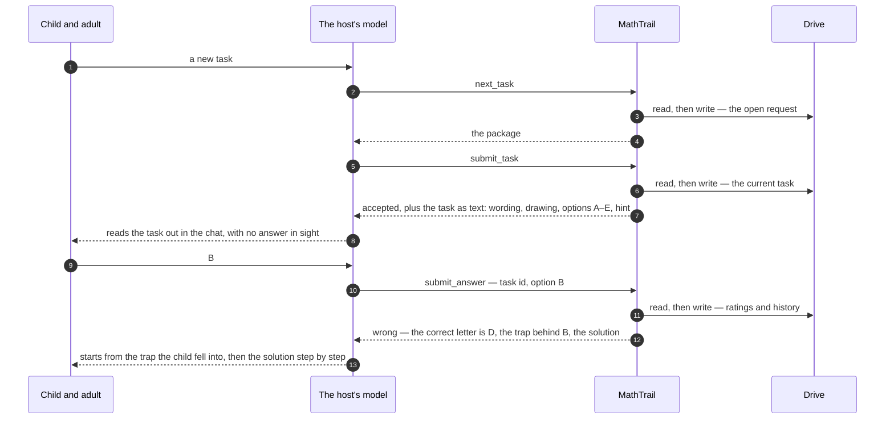
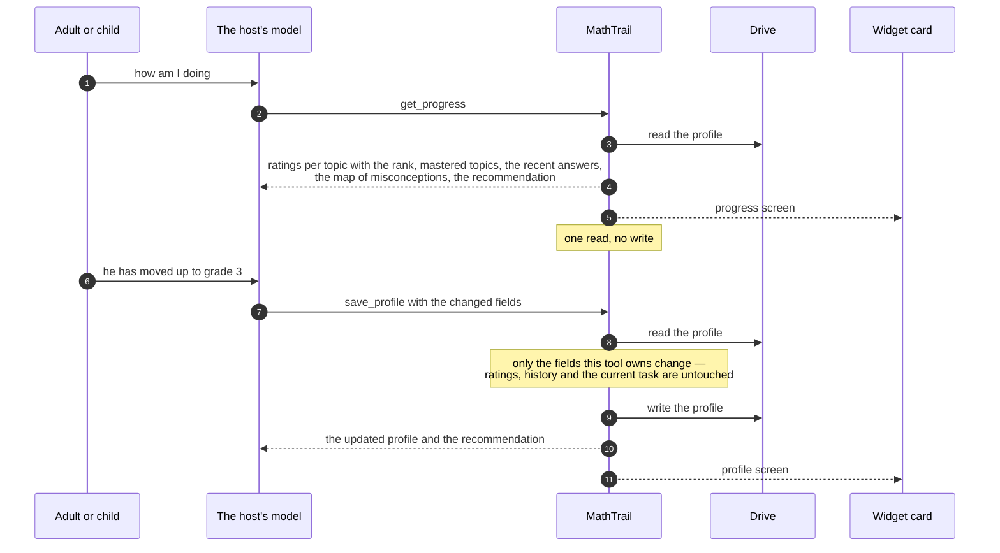
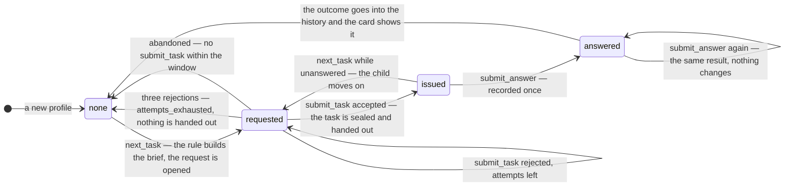

# 03. Tool flows and the task state machine

> Task T08 of [RUN.md](../../RUN.md). Sources: [PRODUCT-V1.md](../../PRODUCT-V1.md) sections 3, 4.1–4.4 and 6; the live spike report [T03](../live/01-spike-protocol.md); implementation decisions [R04–R07](../decisions.md); the context diagram [01](01-context.md) and the sign-in design [02](02-auth.md). The prototype's tool set and refusal codes are carried over from [its SPEC](../prototype/SPEC.md) sections 5 and 6. Tools and widgets are specified in T14, the state machine is implemented in T43–T45, and the screens in T55–T57.

Every tool call has the same shape: **read the profile, compute, write it back**. There is nothing else to read or write — no session, no queue, no task bank (О-6), and no memory between calls (PRODUCT 5, 6). Two callers reach the tools: the host's **model**, which writes the tasks and runs the conversation, and the **widget**, which the child presses buttons in (О-42). They share one source of truth, the profile file in the parent's Drive, and neither has to inform the other for the lesson to work.

Tool names below are the prototype's, kept for continuity; T14 fixes the final ones. Nothing in the instructions for the model depends on an exact name, because the host prefixes them (R07).

## One payload, two readers

The rule everything else follows from:

- the model is assumed to see a tool result **in full** — both `content` and `structuredContent` (О-39, confirmed live in T03);
- the widget rendered from a tool result receives that same result in full: the MCP Apps host delivers `ui/notifications/tool-result` with the whole `CallToolResult` (checked in `@modelcontextprotocol/ext-apps` 2.0.0, the library we follow over the specification text, R06);
- a widget only ever sees results of **its own** invocation — the call that rendered its card, and the calls it makes itself with `callServerTool`.

Three consequences, and they decide the shape of the flows:

1. **The answer is in no payload at all** until the child has answered. Not in `content`, not in `structuredContent`, not in `_meta`. It sits in the sealed block in the profile (О-25) and is unsealed inside `submit_answer` — after the answer has been recorded (PRODUCT 4.4, criterion 11.3).
2. **`next_task` carries no widget.** Its payload is the generation package: three reference tasks with their answers, the trap catalog, templates and frames. A card rendered from that result would put reference answers inside the iframe the child is looking at, which О-26 forbids — so the tool that returns the package renders nothing.
3. **`submit_answer` carries no widget either**, for a different reason: the result screen is a state of the task card the child is already looking at, not a second card. The child presses a button and the same card turns over.
4. **A refusal from `submit_task` names no answer letter and quotes no option.** Whether a card is drawn is a property of the *tool*, not of the individual result — the host reads `_meta.ui.resourceUri` from the tool definition (`getToolUiResourceUri(tool)` in the library) — so `submit_task` draws a card on every call, refusals included. The model already holds its own draft and does not need the letters quoted back to fix it, and this way consequence 1 stays free of exceptions.

Which screen a card shows is decided by the payload, not by the tool: `get_profile` draws the first-sign-in screen when there is no file yet and the profile screen when there is, and `submit_task` draws the task card when it accepts and the waiting screen while it is still refusing.

## The tools, and what each costs in Drive

"Read" and "write" mean the profile as a whole — one logical read and one logical write. How many Drive HTTP calls each takes, and how the file is found, is T10's business (PRODUCT 9.4 asks for the minimum).

| Tool | Called by | Renders a card | Reads | Writes | Not written when |
|---|---|---|---|---|---|
| `get_profile` | the model | yes — profile, or first sign-in when there is no file | 1 | 0 | always |
| `save_profile` | the model | yes — profile | 1 | 1 | the fields fail validation |
| `get_progress` | the model | yes — progress | 1 | 0 | always |
| `next_task` | the model | **no** | 1 | 1 | a limit was hit, or the same open request is returned again |
| `submit_task` | the model | yes — the task card when accepted, the waiting screen when it refuses | 1 | 1 | the request id is stale |
| `submit_answer` | the **widget**, or the model in text mode | **no** — the card turns itself over | 1 | 1 | this task was already answered |

One full task costs three reads and three writes — `next_task`, `submit_task`, `submit_answer` — and one more pair for each rejected attempt. Everything between the read and the write is pure computation: the rule, the checks, the Starlark solver and the ratings never touch the network (01-context).

## Scenario 1. First sign-in

**How to read these diagrams.** `M` and `W` both live inside the host: the model reads tool results as text, the widget is the card the host renders from a result whose tool carries `_meta.ui.resourceUri`. An arrow to `W` therefore means "this same result also draws or updates a card", not a second message from the server. An arrow from `W` to `M` is a host mechanism — `ui/message` or `ui/update-model-context` — not a network call to us.

In text mode the same two calls happen and the parent sees the same information as chat text: the widget adds nothing to what the tools return (О-10).

## Scenario 2. The task, from the rule to the card

**What the model gets and what the child gets.** The model receives the wording, the options and the hint — never the answer, the trap texts or the solution; that is the same split the prototype used, and it is what keeps criterion 11.3 true while the model is still in the conversation. The child sees the card with no answer on it. One honest exception, settled in О-27: the adult who opens the host's own tool-call log sees the task the model submitted, answer included — T03 confirmed Claude shows the raw request JSON. That is outside the threat model and belongs in the privacy policy (T19).

**One request, one generation.** A child who gets impatient and asks again in the chat sets the model off a second time: it calls `next_task`, gets the same open request back, and would cheerfully write a second task for it. Both submissions would then spend attempts from the same counter of three and cut each other's work off, ending in `attempts_exhausted` with nothing to show. So the repeated result says outright that a generation for this request is already under way and how old it is, and asks for the task already written instead of a new one ("Doing nothing twice").

## Scenario 3. The answer, with a widget

**The button records before anything is explained.** The order in the diagram is the requirement: the press calls the tool, the tool writes the profile, and only then is anything said to anybody. Nothing about the recording depends on the model noticing (О-42) — and it must not, because the two mechanisms that tell the model what happened, `ui/message` and `ui/update-model-context`, were only confirmed in T03 as far as "the call returns without an error"; that they land in the conversation has not been seen with human eyes yet. If both silently do nothing, the child still gets the result screen, the ratings are still updated, and the model catches up on its next call, because every tool result carries the outcome of the last answer.

**The model may not state the task's state from memory.** If `ui/update-model-context` is the mechanism that fails, the child is already reading the result screen while the model's context still holds an unanswered task — and a child who then types "but why is that the answer?" would be answered from a picture two minutes out of date. The compensating control is a rule in the instructions (T36): before saying anything about the current task — praising it, explaining it, offering the next one — the model calls a tool and reads the state back. Every tool result carries the outcome of the last recorded answer for exactly this reason, so one call is enough and no round trip is wasted.

The obvious alternative is worse: having the widget send a chat message after every answer would keep the model in step by construction, and would spend a turn of the conversation each time. On a free tier those turns are the scarce resource this whole design protects (PRODUCT 6), and a button that costs none of them is the point of О-42.

**"Hint" and "I don't understand" cost nothing extra.** The hint is part of the task the model submitted, so the widget already has it and reveals it with no call at all; that it was opened travels with the answer. "I don't understand" pressed before answering travels the same way. Pressed after the answer, it is simply a request to the model for a simpler explanation and is not recorded — the lesson is over by then, and О-33 only needs these flags for choosing the next step.

## Scenario 4. The same lesson as text

Text mode is not a reduced version: the same tools, the same payloads, the same number of Drive calls (О-10). The only difference is who draws the card — the widget, or the model with words. The one thing the child loses is the button that records without spending a chat turn, which matters on a free tier (PRODUCT 6).

## Scenario 5. Progress and the profile

Neither tool ever returns the current task's answer, even though both read the file that holds it: the sealed block is opened in exactly one place, `submit_answer`, and only after the answer is recorded.

## The waiting screen and "Next task"

The child presses "Next task" — on the result screen, or on the task card itself, where PRODUCT 4.2 also puts it. Three things then happen, in this order:

1. **The card turns to the waiting screen immediately**, with the status "Preparing the next task…" and a small warm-up if it drags on (О-26). This is local: no call, no wait, and nothing for the child to stare at.
2. **The press reaches the model** through `ui/message`, because generating a task is the model's job and only the model can start it. This is the one step with no fallback inside the product: if a host does not deliver widget messages, the adult types "next task" in the chat and everything else is identical. T03 got as far as "the call succeeds"; T46 and T62–T63 are where it is confirmed for real.
3. **The model calls `next_task`**, writes the task, calls `submit_task`, and the new card appears in the feed below.

The waiting screen has a second source, and it is a gift rather than a complication: a refused `submit_task` draws a card too, and that card is the waiting screen. A generation that takes three attempts therefore leaves the child two visible signs that something is being worked on, instead of ninety silent seconds.

The waiting card does not know when the new one arrives, and it is not worth finding out: the only ways are polling — a Drive read per poll, against a budget PRODUCT 9.4 wants minimal — or a host mechanism nobody has verified. So the child's attention moves to the new card that appears below, and the old one is left behind.

**Left behind, but not left spinning.** A card that animates for ever claims something is happening long after nothing is, and the fallback this design leans on — the adult types "next task" into the chat — never occurs to anybody while the screen still looks busy. So the waiting screen has a deadline: **after 120 seconds** with no new card it stops looking like work in progress and says plainly that the task is not being prepared, that it can be asked for in the chat, and offers a button that sends the request once more. It is a local timer — no call, no Drive read, no dependence on the host — and 120 seconds is about 1.7 times the prototype's 69-second median (PRODUCT 4.4), far enough out that an ordinary generation is never interrupted by it. T56 draws it; the deadline itself is part of the flow, not of the drawing.

That is the only place in the lesson where anything gives up on its own. Nothing else has a timeout: a generation takes as long as the model takes.

## The state machine of the current task

Two transitions are worth their own sentence:

- **`requested → none` after three attempts.** The child is handed nothing, the model says so and may ask for a new task, and the daily counter of accepted tasks is untouched — a refused attempt is not a generation (О-35). The counter of failed generations goes up instead, and it is what stops the loop ("The daily counters"). Three is the prototype's limit and its reasoning holds: after two pointed corrections a model usually cycles through the same broken variants, and a refusal is itself a signal about which topics and traps it stumbles on.
- **`issued → requested`, skipping an unanswered task.** PRODUCT 4.2 puts "Next task" on the task card, so the child may walk away from a task they do not want. The skipped task leaves no trace in the ratings — there is no answer to learn from (О-33) — but its fingerprint stays in the profile, so it will not come back as a near-duplicate. The generation it cost is not refunded: it was an accepted task.

## Doing nothing twice

The service keeps no memory between calls, so every "only once" rule is a field in the profile, checked inside the same read-compute-write:

| What could happen twice | What stops it |
|---|---|
| The model calls `next_task` twice for the same request | While an open request is younger than the abandonment window, `next_task` returns **the same** request id and the same brief instead of opening a second one, and writes nothing. The repeat also says so: it carries that the request is already open and how many seconds ago it started, and asks for the task already written rather than a second one |
| An attempt is submitted against an old request | `submit_task` carries the request id; anything but the open one is `stale_request`, and no attempt is spent |
| A fourth attempt | The counter lives in the open request, not in the model's memory, so it survives a restart, another instance and a forgetful model |
| The same task is answered twice — the child presses a button and the model also calls the tool | `submit_answer` is keyed by the task id: the first call records, any later one returns the same recorded result and writes nothing. Ratings move once |
| Two tabs or two devices answer at once | The same key, plus the revision check on the write (T10, T51): the loser retries, sees the answer already recorded, and returns it |
| The same task text comes back later | The fingerprints of past tasks are kept in the profile and the near-duplicate check runs inside `submit_task` (T32); the profile holds fingerprints, not texts (О-40) |

## The daily counters

The unit of the daily limit is **an accepted task** (О-35). It follows that:

- it is **checked** in `next_task`, before the model spends a minute writing something it cannot be given — the refusal names when the child may come back;
- it is **incremented** in `submit_task`, in the same write that makes the task current, and only when the task is accepted;
- an abandoned request, a rejected attempt, a refusal after three attempts and a skipped task cost nothing against it;
- it lives in the profile, so it is shared by every instance (О-15, О-24) — the request rate, by contrast, is counted per instance in memory and may therefore be several times looser;
- the overshoot is bounded at one: a child at the limit can have at most one request already open when the last acceptance lands.

The counter carries the date it belongs to and resets when the date changes. The service has no reliable idea of the family's timezone, so that date is UTC. The number itself is set in T52, and the field in T09.

**The second counter: failed generations.** О-35 is deliberate — a refusal must not cost the child a task they never received — but on its own it leaves a loop with nothing shared to stop it. A model that keeps failing the checks on some topic exhausts its three attempts, the request closes, and it may ask again immediately, for ever. The request rate looks like the brake and is not much of one: it is counted in each instance's memory and can be several times looser than it reads (О-24). What that loop costs is worth naming precisely, because it is not what it looks like either — the service makes no LLM calls at all (PRODUCT 4.3), so nobody is paying us for tokens. It costs the family their message limit on a free tier, which is the scarce resource of the whole product (PRODUCT 6), and it costs a stream of Drive calls.

So `daily` carries a second counter, `failed`, raised whenever a request ends in `attempts_exhausted`, and `next_task` refuses once it reaches its ceiling — five in a day by default, with the number set in T52. The refusal is `limit_reached` with its own wording and its own reason in the log; it needs no code of its own. The daily generation limit keeps its unit exactly as О-35 defined it, an accepted task: this is a separate fuse, not a redefinition.

## Refusal codes, and what goes back to the model

Every failed check comes back at once, so the model can fix everything in one more attempt; the code is the first failure in check order. This is the prototype's list plus what v1 added; **T12 fixes the final set and the exact names**, and the schemas follow in T23.

| Code | When | What the model is told | Costs an attempt |
|---|---|---|---|
| `bad_structure` | the JSON schema or the structural rules fail: not five distinct options, a wrong option with no trap or no explanation, an unknown trap, topic or skill id, a brief that does not match the request | which field is wrong and what was expected | yes |
| `distractor_explanations` (name fixed in T12) | the four deterministic conditions of R10: the explanations are not pairwise distinct, one repeats the solution or the hint, one is the catalog's trap description verbatim, or one is too short for its writing system | which option to rewrite and which condition it broke | yes |
| `solver_error` | the Starlark program crashed, ran past its step or time limit, or printed something other than a list of letters | one short safe line and the limit it hit — never the interpreter's internals (О-8) | yes |
| `solver_disagrees` | the solver, or the model's own self-check, produced a different answer than the one submitted | that the three do not agree, and which of them disagrees — without quoting a letter, because a refusal draws a card | yes |
| `self_check_blocking` | the self-check contains a blocking remark | the remark the model itself wrote, handed back | yes |
| `readability` | the longest sentence is over the threshold for the task's level, or the Flesch–Kincaid index is too high (English only) | the measured value and the threshold for that level | yes |
| `near_duplicate` | too close to a task this child has already seen or to a reference task | that it is a near-repeat and what to change — never the matching text, which the profile does not keep anyway (О-40) | yes |
| `drawing_format` | width, number of lines, characters or prohibitions (О-11а, О-37) | which limit was exceeded | yes |
| `drawing_mismatch` | the labels in the wording and in the structural description disagree (О-37) | which labels do not match | yes |
| `stale_request` | the request id is not the open one, or there is no open request | ask for a task first | no |
| `attempts_exhausted` | the third rejection | nothing was handed out, a new task may be requested, and the daily limit was not touched | the request closes |
| `limit_reached` | the daily limit of accepted tasks, the ceiling on failed generations, or the request rate (T52) | a plain sentence the model relays to the child, and when to come back; which of the three ceilings it was goes into the log, not to the child | no |

Two rules about the wording of all of them: they are written for a model that has to act on them, so they name the field and the fix rather than the internal error (CLAUDE.md, "Errors"); and none of them is ever rendered as a card, so nothing in them reaches the child directly.

## Coverage of PRODUCT 3 and 4.3–4.4

| Requirement | Where |
|---|---|
| 3.1 The parent connects the app, signs in, grants storage | 02-auth; scenario 1 |
| 3.1 The profile is created: pseudonym, grade, interests, constraints | Scenario 1, `save_profile` |
| 3.1 The child sees a waiting screen while the first task is written | Scenario 1's last step, "The waiting screen and Next task" |
| 3.2 The card: wording, drawing, five answer buttons without letters (R70), Hint, I don't understand, Next task | Scenario 2's last step; scenario 3 for the three buttons |
| 3.3 Pressing a button records the answer before any explanation | Scenario 3, and the paragraph under it |
| 3.3 Correct — brief praise; wrong — the trap first, then the solution | Scenario 3 and 4: the payload of `submit_answer` is the same in both modes |
| 3.3 "I don't understand" — a simpler explanation | Scenario 3, the last two steps |
| 3.4 The next task at the press of a button, with a waiting screen | "The waiting screen and Next task" |
| 3.5 Progress: ratings, ranks, mastered topics, recent answers, one topic to practise | Scenario 5 |
| 3.6 The profile: the parent views and edits | Scenario 5 |
| 4.3 The brief comes from the rule; the model may override it with a reason | Scenario 2, `next_task` and `tutor_mode` |
| 4.3 The package handed to the model | Scenario 2, the `next_task` result |
| 4.3 The checks, and up to three attempts per request | Scenario 2's loop; the state machine; the refusal codes |
| 4.3 An accepted task becomes the current one; a draft is never shown | Scenario 2: only an accepted `submit_task` renders a card |
| 4.4 No pre-generated tasks | The state machine starts at `none` and only `next_task` leaves it |
| 4.4 One current task, kept until it is answered | The state machine; `submit_answer` is keyed by the task id |
| 4.4 The answer is sealed and appears nowhere before the answer | "One payload, two readers"; scenarios 2, 3 and 5 |
| 4.4 The tool-call log is outside the threat model (О-27) | The paragraph under scenario 2 |
| 4.4 The waiting screen and the warm-up (О-26) | "The waiting screen and Next task" |
| 6 Every tool's Drive reads and writes are known | "The tools, and what each costs in Drive" |
| 6 The daily limit and the request rate | "The daily counters"; `limit_reached` |
| 6 The free tiers' message budget | Scenario 3: a button press spends no model turn |

## Notes for PRODUCT/SPEC

Found while drawing the flows. None changes a product decision, so none becomes an open question in PRODUCT 12.2.

1. **Two host mechanisms are still only half-verified.** `ui/message` and `ui/update-model-context` returned successfully in T03 but were never seen landing in a conversation. Nothing depends on them for correctness — the answer is recorded by the tool — but each needs a compensating control that has to be built rather than assumed: a deadline on the waiting screen for a lost `ui/message`, and the rule never to speak about the current task from memory for a lost `ui/update-model-context`. Both are specified above. **For:** T46 and T62–T63, which must watch for both in the transcript; T56 and T36, which build the two controls.
2. **`submit_answer` renders no card of its own.** In a widget host where the child types the letter in the chat instead of pressing a button, the task card therefore keeps showing the task while the model explains in words. The alternative — giving the tool its own widget — risks two cards for one press, which T03 never tested ("several widgets in one turn" is still `?` in its matrix). **For:** T55 and T56, and worth one live check in T62.
3. **The waiting card cannot dismiss itself, so it has a deadline instead.** Polling would cost a Drive read each time, so after 120 seconds the card stops looking busy and points at the chat ("The waiting screen and Next task"). The number is a requirement of the flow; what the card looks like when it fires is **for:** T56.
4. **The day of the daily counters is a UTC day.** It costs less than it looks: the product shows no rhythm of practice at all (R13, О-49), so an early rollover makes a limit looser for one evening and never stricter. If exactness is wanted, the widget knows the browser's timezone and could pass it. **For:** T09 and T52.
5. **The abandonment window for an open request is a number nobody has fixed yet** — around fifteen minutes fits a 69-second median and three attempts. **For:** T15, confirmed in T52.
6. **Skipping an unanswered task is allowed** because PRODUCT 4.2 puts "Next task" on the task card. It costs a generation and leaves no rating trace. **For:** T15, to carry into SPEC explicitly.
7. **Every tool result carries the outcome of the last recorded answer** — one line, so a model that missed the widget's message does not congratulate a child on a task they got wrong. It is what makes the rule of scenario 3 — read the state back before speaking about it — cost a single call. **For:** T14, in the output schemas, and T36 for the rule itself.
8. **A tool cannot decide per call whether it draws a card.** The host takes `_meta.ui.resourceUri` from the tool definition, so `submit_task` draws one even when it refuses — which is why refusals are written to name no answer letter, and why the widget has to render sensibly from a payload that carries no task. **For:** T14 and T55–T56; worth confirming in T62 that Claude does not also draw a card for a call the widget itself made.
9. **`next_task` has to be able to say "already under way".** The repeat of an open request carries a flag and the request's age, so an impatient second ask does not become a second generation racing the first for the same three attempts. **For:** T14, in the output schema, and T44.
10. **The ceiling on failed generations is a new number in the profile.** `daily.failed` and its limit of five a day come from this pass, not from a product decision; О-35 is untouched. **For:** T09, T26 and T52, and entry R15 in the decision log.
