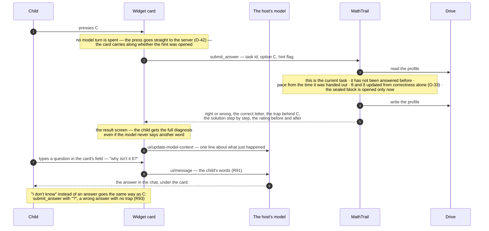
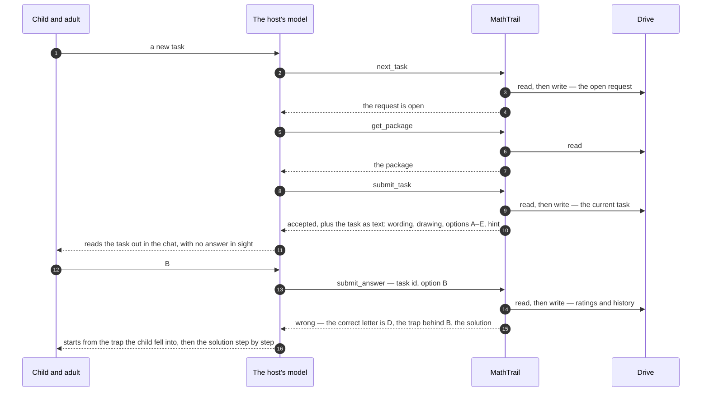
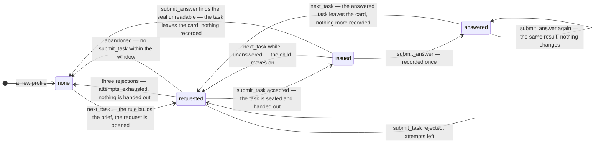

# 03. Tool flows and the task state machine

> Task T08 of [RUN.md](../../RUN.md). Sources: [PRODUCT-V1.md](../../PRODUCT-V1.md) sections 3, 4.1–4.4 and 6; the live spike report [T03](../live/01-spike-protocol.md); implementation decisions [R04–R07](../decisions.md); the context diagram [01](01-context.md) and the sign-in design [02](02-auth.md). The prototype's tool set and refusal codes are carried over from [its SPEC](../prototype/SPEC.md) sections 5 and 6. Tools and widgets are specified in T14, the state machine is implemented in T43–T45, and the screens in T55–T57.

Every tool call has the same shape: **read the profile, compute, write it back**. There is nothing else to read or write — no session, no queue, no task bank (О-6), and no memory between calls (PRODUCT 5, 6). Two callers reach the tools: the host's **model**, which writes the tasks and runs the conversation, and the **widget**, which the child presses buttons in (О-42). They share one source of truth, the profile file in the parent's Drive, and neither has to inform the other for the lesson to work.

Tool names below are the prototype's, kept for continuity; T14 fixes the final ones. Nothing in the instructions for the model depends on an exact name, because the host prefixes them (R07).

## One payload, two readers

The rule everything else follows from:

- the model is assumed to see a tool result **in full** — both `content` and `structuredContent` (О-39, confirmed live in T03);
- the widget rendered from a tool result receives that same result in full: the MCP Apps host delivers `ui/notifications/tool-result` with the whole `CallToolResult` (checked in `@modelcontextprotocol/ext-apps` 2.0.0, the library we follow over the specification text, R06);
- a widget only ever sees results of **its own** invocation — the call that rendered its card, and the calls it makes itself with `callServerTool`.

Three consequences, and they decide the shape of the flows:

1. **The answer is in no payload at all** until the child has answered. Not in `content`, not in `structuredContent`, not in `_meta`. It sits in the sealed block in the profile (О-25) and is unsealed inside `submit_answer` — once the child has answered, and again for the same answer sent twice (PRODUCT 4.4, criterion 11.3).
2. **The tool that hands over the package carries no widget.** The generation package — three reference tasks with their answers, the trap catalog, templates and frames — goes to the model through `get_package`, which renders nothing: a card rendered from its result would put reference answers inside the iframe the child is looking at, which О-26 forbids. `next_task` draws the card the task will come to, and carries no package, in its payload or in its words (R152).
3. **`submit_answer` carries no widget either**, for a different reason: the result screen is a state of the task card the child is already looking at, not a second card. The child presses a button and the same card turns over.
4. **A refusal from `submit_task` names no answer letter and quotes no option.** Whether a card is drawn is a property of the *tool*, not of the individual result — the host reads `_meta.ui.resourceUri` from the tool definition (`getToolUiResourceUri(tool)` in the library) — so a tool that draws a card draws it on every call, refusals included. `submit_task` draws none since R152, but a host with an earlier list of the tools still draws one for it, so its refusals stay as they were. The model already holds its own draft and does not need the letters quoted back to fix it, and this way consequence 1 stays free of exceptions.

Which screen a card shows is decided by the payload, not by the tool: `get_progress` draws the first-sign-in screen when there is no file yet and the progress when there is, and `next_task` draws the task on its way when it opens a request, and the waiting screen when it refuses one (R152).

## The tools, and what each costs in Drive

"Read" and "write" mean the profile as a whole — one logical read and one logical write. How many Drive HTTP calls each takes, and how the file is found, is T10's business (PRODUCT 9.4 asks for the minimum).

| Tool | Called by | Renders a card | Reads | Writes | Not written when |
|---|---|---|---|---|---|
| `get_profile` | the model | **no** — the profile is shown in the progress's Profile section (R148, R162) | 1 | 0 | always |
| `save_profile` | the model | **no** — the model says in a sentence what was saved (R148) | 1 | 1 | the fields fail validation, or ask for what the profile already says |
| `edit_profile` | the widget only, from the form in the progress's Profile section (R148, R162) | **no** — the card that called it shows the details saved | 1 | 1 | the fields fail validation, change nothing, or there is no profile — a form never makes one |
| `get_progress` | the model | yes — progress | 1 | 0 | always |
| `read_progress` | the widget only, from the line at the top of a card (R91, R97) | **no** — the card that called it turns to its progress | 1 | 0 | always |
| `next_task` | the model | yes — the task on its way, which turns into the task (R152) | 1 | 1 | a limit was hit, or the same open request is returned again |
| `get_package` | the model | **no** — the package is for the model alone (R152) | 1 | 0 | always |
| `submit_task` | the model | **no** — the card `next_task` drew turns into the task (R152) | 1 | 1 | the request id is stale |
| `read_task` | the widget only, from the card `next_task` drew (R152) | **no** — the card that called it turns into its task | 1 | 0 | always |
| `submit_answer` | the **widget**, or the model in text mode | **no** — the card turns itself over | 1 | 1 | this task was already answered |

One full task costs four reads and three writes — `next_task`, `get_package`, `submit_task`, `submit_answer` —, one more pair for each rejected attempt, and one read for each question the card asks while it waits: every four seconds while the task is written, about fifteen for a minute's wait (R152). Opening the progress from a card costs one read more, and the search and the folder's name that say where the profile's file is (R147). Everything between the read and the write is pure computation: the rule, the checks, the Starlark solver and the ratings never touch the network (01-context).

## Scenario 1. First sign-in

```mermaid
sequenceDiagram
    autonumber
    participant A as Adult
    participant M as The host's model
    participant MT as MathTrail
    participant D as Drive
    participant W as Widget card

    Note over A,MT: the connector is added and the parent signs in — see 02-auth
    A->>M: let us start
    M->>MT: next_task
    MT->>D: look for the profile file
    D-->>MT: there is none yet
    MT-->>M: no profile: ask the adult to say they are the parent or tutor, then for the fields one needs to create it
    MT-->>W: the first sign-in card, which only tells (R148, R152)
    A->>M: parent or tutor; pseudonym, grade, interests, constraints
    M->>MT: save_profile
    MT->>D: create the file
    D-->>MT: the new revision
    MT-->>M: the profile, and the rule's recommendation for the first task — no card (R148)
    M-->>A: the profile is saved, in a sentence, and a first task is offered
```

**How to read these diagrams.** `M` and `W` both live inside the host: the model reads tool results as text, the widget is the card the host renders from a result whose tool carries `_meta.ui.resourceUri`. An arrow to `W` therefore means "this same result also draws or updates a card", not a second message from the server. An arrow from `W` to `M` is a host mechanism — `ui/message` or `ui/update-model-context` — not a network call to us.

In text mode the same two calls happen and the parent sees the same information as chat text: the widget adds nothing to what the tools return (О-10).

## Scenario 2. The task, from the rule to the card

```mermaid
sequenceDiagram
    autonumber
    participant K as Child
    participant M as The host's model
    participant MT as MathTrail
    participant D as Drive
    participant W as Widget card

    K->>M: a new task, please
    M->>MT: next_task, with the chat language and, if it wants, its own topic or difficulty and a reason
    Note over W: the host draws the card as the call starts: "Preparing the next task…", the topic being picked
    MT->>D: read the profile
    Note over MT: the daily and rate limits · the rule picks topic, goal and corridor ·<br/>the model's override is recorded as tutor_mode · the open request is written down:<br/>id, brief, attempts 0, started at
    MT->>D: write the profile
    MT-->>M: request open: get its package, write the task, hand it in
    MT-->>W: the task on its way — the request, whose card it is, its language, and no package
    M->>MT: get_package with the request id
    MT->>D: read the profile
    MT-->>M: the package — brief, corridor, three reference tasks, the traps,<br/>the prohibitions, the formats, the solver templates, the drawing frames,<br/>the checklist and the instructions version
    Note over M,W: no card is drawn from the package: the reference tasks carry their answers

    par the card asks how the task stands, every few seconds
        W->>MT: read_task with the request id
        MT->>D: read the profile
        MT-->>W: being written, and how many tries were turned down
    and at most three attempts
        Note over M: the model writes the task, the Starlark solver and its self-check
        M->>MT: submit_task with the request id
        MT->>D: read the profile
        Note over MT: structure · the explanations behind the wrong options · the solver runs ·<br/>the self-check · readability for the level · near-duplicates · the drawing
        alt something failed
            Note over MT: the attempt counter goes up
            MT->>D: write the profile
            MT-->>M: every failed check at once, with the first one as the code<br/>and no answer letter anywhere in it
        else accepted
            Note over MT: the task becomes the current one, under the id its request gives it,<br/>the answer and the trap texts go into the sealed block, the request closes,<br/>the daily counter goes up, the fingerprint is kept for the duplicate check
            MT->>D: write the profile
            MT-->>M: accepted, plus the task exactly as the child will see it
        end
    end
    W->>MT: read_task with the request id
    MT->>D: read the profile
    MT-->>W: the task on the card — wording, drawing, five answer buttons, Hint;<br/>the card turns into it
```

**What the model gets and what the child gets.** The model receives the wording, the options and the hint — never the answer, the trap texts or the solution; that is the same split the prototype used, and it is what keeps criterion 11.3 true while the model is still in the conversation. The child sees the card with no answer on it. One honest exception, settled in О-27: the adult who opens the host's own tool-call log sees the task the model submitted, answer included — T03 confirmed Claude shows the raw request JSON. That is outside the threat model and belongs in the privacy policy (T19).

**One request, one generation.** A child who gets impatient and asks again in the chat sets the model off a second time: it calls `next_task`, gets the same open request back, and would cheerfully write a second task for it. Both submissions would then spend attempts from the same counter of three and cut each other's work off, ending in `attempts_exhausted` with nothing to show. So the repeated result says outright that the request is already open and how old it is, and asks for the task already written instead of a new one ("Doing nothing twice"). Only a model that has not written it — its turn cut short, say — is told the task is its to write, and sent for the package with `get_package`: the first live run's model, shown no more than a request open and a card waiting, took the service for the task's writer and kept asking (T46, R102).

## Scenario 3. The answer, with a widget

```mermaid
sequenceDiagram
    autonumber
    participant K as Child
    participant W as Widget card
    participant M as The host's model
    participant MT as MathTrail
    participant D as Drive

    K->>W: presses C
    Note over W: no model turn is spent — the press goes straight to the server (О-42) —<br/>the card carries along whether the hint was opened
    W->>MT: submit_answer — task id, option C, hint flag
    MT->>D: read the profile
    Note over MT: this is the current task · it has not been answered before ·<br/>pace from the time it was handed out · θ and δ updated from correctness alone (О-33) ·<br/>the sealed block is opened only now
    MT->>D: write the profile
    MT-->>W: right or wrong, the correct letter, the trap behind C,<br/>the solution step by step, the rating before and after
    Note over W: the result screen — the child gets the full diagnosis<br/>even if the model never says another word
    W->>M: ui/update-model-context — one line about what just happened
    K->>W: types a question in the card's field — "why isn't it 6?"
    W->>M: ui/message — the child's words (R91)
    M-->>K: the answer in the chat, under the card
    Note over K,W: "I don't know" instead of an answer goes the same way as C:<br/>submit_answer with "?", a wrong answer with no trap (R93)
```

**The button records before anything is explained.** The order in the diagram is the requirement: the press calls the tool, the tool writes the profile, and only then is anything said to anybody. Nothing about the recording depends on the model noticing (О-42) — and it must not, because the two mechanisms that tell the model what happened, `ui/message` and `ui/update-model-context`, were only confirmed in T03 as far as "the call returns without an error"; that they land in the conversation has not been seen with human eyes yet. If both silently do nothing, the child still gets the result screen, the ratings are still updated, and the model catches up on its next call, because every tool result carries the outcome of the last answer.

**The model may not state the task's state from memory.** If `ui/update-model-context` is the mechanism that fails, the child is already reading the result screen while the model's context still holds an unanswered task — and a child who then types "but why is that the answer?" would be answered from a picture two minutes out of date. The compensating control is a rule in the instructions (T36): before saying anything about the current task — praising it, explaining it, offering the next one — the model calls a tool and reads the state back. Every tool result carries the outcome of the last recorded answer for exactly this reason, so one call is enough and no round trip is wasted.

The obvious alternative is worse: having the widget send a chat message after every answer would keep the model in step by construction, and would spend a turn of the conversation each time. On a free tier those turns are the scarce resource this whole design protects (PRODUCT 6), and a button that costs none of them is the point of О-42.

**"Hint" costs nothing extra, and "I don't know" is an answer.** The hint is part of the task the model submitted, so the widget already has it and reveals it with no call at all; that it was opened travels with the answer. "I don't know", pressed before answering, shows the solution, so it is recorded like any answer — `submit_answer` with `?`, a wrong answer for the rating, with no trap (R93). A question about the task is asked in the chat, before the answer or after; the model answers there, and nothing is recorded (R91, R145). Before the answer it helps without giving the answer away, as its instructions require for anything said about an open task; after it, the chat is where the child asks why.

## Scenario 4. The same lesson as text

```mermaid
sequenceDiagram
    autonumber
    participant K as Child and adult
    participant M as The host's model
    participant MT as MathTrail
    participant D as Drive

    K->>M: a new task
    M->>MT: next_task
    MT->>D: read, then write — the open request
    MT-->>M: the request is open
    M->>MT: get_package
    MT->>D: read
    MT-->>M: the package
    M->>MT: submit_task
    MT->>D: read, then write — the current task
    MT-->>M: accepted, plus the task as text: wording, drawing, options A–E, hint
    M-->>K: reads the task out in the chat, with no answer in sight
    K->>M: B
    M->>MT: submit_answer — task id, option B
    MT->>D: read, then write — ratings and history
    MT-->>M: wrong — the correct letter is D, the trap behind B, the solution
    M-->>K: starts from the trap the child fell into, then the solution step by step
```

Text mode is not a reduced version: the same tools, the same payloads and, but for the questions a card asks while it waits, the same Drive calls (О-10). The only difference is who draws the card — the widget, or the model with words. The one thing the child loses is the button that records without spending a chat turn, which matters on a free tier (PRODUCT 6).

## Scenario 5. Progress and the profile

```mermaid
sequenceDiagram
    autonumber
    participant A as Adult or child
    participant M as The host's model
    participant MT as MathTrail
    participant D as Drive
    participant W as Widget card
    participant S as The site

    A->>M: how am I doing
    M->>MT: get_progress
    MT->>D: read the profile
    MT-->>M: ratings per topic with the rank, mastered topics, the recent answers,<br/>the map of misconceptions, the recommendation
    MT-->>W: progress screen
    Note over MT: one read, no write

    A->>W: "Profile & progress" on a task card
    W->>MT: read_progress — the widget's own tool, which draws no card (R97)
    MT->>D: read the profile
    MT-->>W: the same progress, with the profile's fields and where its file is
    Note over W: drawn in the same card, "Back to task" returns to it — the model is not asked

    A->>W: a topic's name, on a host that said it opens links
    W->>S: ui/open-link — the host opens the topic's page, at the address the card built (R186)
    Note over W: a host that refuses, fails or never answers leaves the address on the card, to copy

    A->>M: he has moved up to grade 3
    M->>MT: save_profile with the changed fields
    MT->>D: read the profile
    Note over MT: only the fields this tool owns change —<br/>ratings, history and the current task are untouched
    MT->>D: write the profile
    MT-->>M: the updated profile and the recommendation — no card (R148)

    A->>W: "Edit" in the progress's Profile section; the form filled in and saved
    W->>MT: edit_profile — the fields that changed, and no other (R148)
    MT->>D: read the profile, then write it
    MT-->>W: the details as they now stand, and the words of the change
    W->>M: ui/update-model-context — the change, the notes left out
    Note over W: the form closes and says "Saved"; nothing is asked of the model
```

None of these tools ever returns the current task's answer, even though each reads the file that holds it: the sealed block is opened in exactly one place, `submit_answer`, and only once the child has answered.

## The waiting screen and "Another task"

The child presses "Another task" — on the result screen, or on the task card itself, where PRODUCT 4.2 also puts it. Three things then happen, in this order:

1. **The card keeps its task and says that, once the ask reaches the chat, the new one will come below**, in a card of its own (R145). It does not turn to a waiting screen: a host may hold the card's message for the person to send, and a card cannot see whether it went, so a wait drawn there could tick off steps while nothing is being written. While the ask is on its way the button takes no second press; once the host has it, it may be pressed again.
2. **The press reaches the model** through `ui/message`, because generating a task is the model's job and only the model can start it. This is the one step with no fallback inside the product: if a host does not deliver widget messages, the adult types "next task" in the chat and everything else is identical. A host that refuses the message says so, and the card says the ask was not sent and takes it again. T03 got as far as "the call succeeds"; T46 and T62–T63 are where it is confirmed for real.
3. **The model calls `next_task`**, and the card the host draws for that call, as the call starts, is the wait (R152): it knows it is a task's card from the host's `toolInfo`, and shows "Preparing the next task…" a moment after it is drawn, the topic being picked. The model then gets the package with `get_package`, writes the task and hands it in with `submit_task`, which draws no card. Meanwhile the card, handed the request by `next_task`'s result, asks `read_task` how the task stands — a moment after it is drawn, then every four seconds — and shows it being written, and a try the checks turned down with a new one being written; once the task is accepted, the next question finds it on the card, and the card turns into it.

A card cannot learn of a call that did not draw it ("One payload, two readers"), so it asks, and each question is a Drive read: about fifteen for a minute's wait, one at a time, none while the page is out of sight. The rejection of such a card in R134 and R146 counted on a wait that starts with the hand-in; the author's live check of 2026-10-03 found the hand-in a minute after the ask (R152).

A request that ends with no task — three tries refused, the window passed, a newer request — is said on the card at the first answer that says so, and settled at the second, since a read straight after a write may bring the file as it was before it: no task is here, with the line that the next one comes below or, if none does, that a task can be asked for in the chat. The words are the same whatever ended it, since the card cannot tell. A card drawn again with an earlier chat says the same, its task long gone: the profile keeps the current task alone.

**Not left spinning.** A wait that animates for ever claims something is happening long after nothing is, and the fallback this design leans on — the adult types "next task" into the chat — never occurs to anybody while the screen still looks busy. So the card says, **two minutes after the wait last had news** — the card drawn, the task heard of, a try turned down —, that the task is taking longer than usual and can be asked for in the chat if it does not appear, and asks every fifteen seconds from then on, until the task comes or the request is over — or twenty questions in a row have gone unanswered, when it stops asking. A call the host cancels before `next_task` answers says at once that the task was not finished.

Nothing else has a timeout: a generation takes as long as the model takes.

## The state machine of the current task

```mermaid
stateDiagram-v2
    direction LR
    [*] --> none: a new profile
    none --> requested: next_task — the rule builds the brief, the request is opened
    requested --> requested: submit_task rejected, attempts left
    requested --> issued: submit_task accepted — the task is sealed and handed out
    requested --> none: three rejections — attempts_exhausted, nothing is handed out
    requested --> none: abandoned — no submit_task within the window
    issued --> answered: submit_answer — recorded once
    issued --> requested: next_task while unanswered — the child moves on
    answered --> answered: submit_answer again — the same result, nothing changes
    answered --> requested: next_task — the answered task leaves the card, nothing more recorded
    issued --> none: submit_answer finds the seal unreadable — the task leaves the card, nothing recorded
```

Two transitions are worth their own sentence:

- **`requested → none` after three attempts.** The child is handed nothing, the model says so and may ask for a new task, and the daily counter of accepted tasks is untouched — a refused attempt is not a generation (О-35). The counter of failed generations goes up instead, and it is what stops the loop ("The daily counters"). Three is the prototype's limit and its reasoning holds: after two pointed corrections a model usually cycles through the same broken variants, and a refusal is itself a signal about which topics and traps it stumbles on.
- **`issued → requested`, skipping an unanswered task.** PRODUCT 4.2 puts "Another task" on the task card, so the child may walk away from a task they do not want. The skipped task leaves no trace in the ratings — there is no answer to learn from (О-33) — but it is recorded: `next_task`, asked for a new task while this one has no answer, writes it into the history as skipped — whether or not a new task ever arrives — and the progress screen shows it, so leafing past hard tasks is something the parent can see (R98). Its fingerprint stays in the profile too, so it will not come back as a near-duplicate. The generation it cost is not refunded: it was an accepted task.

## Doing nothing twice

The service keeps no memory between calls, so every "only once" rule is a field in the profile, checked inside the same read-compute-write:

| What could happen twice | What stops it |
|---|---|
| The model calls `next_task` twice for the same request | While an open request is younger than the abandonment window, `next_task` returns **the same** request id and the same brief instead of opening a second one, and writes nothing. The repeat also says so: it carries that the request is already open and how many seconds ago it started, and asks for the task already written rather than a second one; only a model that has not written it is told to write it. The second card it draws waits for the same task as the first, and both turn into it |
| A card is told no task is coming by a read that lags behind a write | The card shows it at the first answer that says so and settles it only at the second; an answer that says otherwise takes it back (R152) |
| An attempt is submitted against an old request | `submit_task` carries the request id; anything but the open one — and the open one once it has waited past the abandonment window — is `stale_request`, and no attempt is spent. When the child already has a task, the card that refusal draws shows it: a task handed in twice, the answer to the first gone astray, must not turn the card the child is working on into a wait |
| A fourth attempt | The counter lives in the open request, not in the model's memory, so it survives a restart, another instance and a forgetful model |
| The same task is answered twice — the child presses a button and the model also calls the tool | `submit_answer` is keyed by the task id: the first call records, any later one returns the same recorded result and writes nothing. Ratings move once. The task keeps the answer it was given until the next task is asked for, which is how a later call can tell the same result again (04-profile, R101) |
| Two tabs or two devices answer at once | The same key, plus the revision check on the write (T10, T51): the loser retries, sees the answer already recorded, and returns it |
| The same task text comes back later | The fingerprints of past tasks are kept in the profile and the near-duplicate check runs inside `submit_task` (T32); the profile holds fingerprints, not texts (О-40) |

## The daily counters

The unit of the daily limit is **an accepted task** (О-35). It follows that:

- it is **checked** in `next_task`, before the model spends a minute writing something it cannot be given — the refusal names when the child may come back;
- it is **incremented** in `submit_task`, in the same write that makes the task current, and only when the task is accepted;
- an abandoned request, a rejected attempt, a refusal after three attempts and a skipped task cost nothing against it;
- it lives in the profile, so it is shared by every instance (О-15, О-24) — the request rate, by contrast, is counted per instance in memory and may therefore be several times looser;
- the overshoot is bounded at one: a child at the limit can have at most one request already open when the last acceptance lands.

The counter carries the date it belongs to and resets when the date changes. The service has no reliable idea of the family's timezone, so that date is UTC. The number is `MATHTRAIL_DAILY_TASKS`, twenty by default (SPEC 11.2), and the field is T09's.

**The second counter: failed generations.** О-35 is deliberate — a refusal must not cost the child a task they never received — but on its own it leaves a loop with nothing shared to stop it. A model that keeps failing the checks on some topic exhausts its three attempts, the request closes, and it may ask again immediately, for ever. The request rate looks like the brake and is not much of one: it is counted in each instance's memory and can be several times looser than it reads (О-24). What that loop costs is worth naming precisely, because it is not what it looks like either — the service makes no LLM calls at all (PRODUCT 4.3), so nobody is paying us for tokens. It costs the family their message limit on a free tier, which is the scarce resource of the whole product (PRODUCT 6), and it costs a stream of Drive calls.

So `daily` carries a second counter, `failed`, raised whenever a request ends in `attempts_exhausted`, and `next_task` refuses once it reaches its ceiling — five in a day by default, `MATHTRAIL_DAILY_FAILED`. The refusal is `limit_reached` with its own wording and its own reason in the log; it needs no code of its own. The daily generation limit keeps its unit exactly as О-35 defined it, an accepted task: this is a separate fuse, not a redefinition.

## Refusal codes, and what goes back to the model

Every failed check comes back at once, so the model can fix everything in one more attempt; the code is the first failure in check order. This is the prototype's list plus what v1 added; **T12 fixes the final set and the exact names**, and the schemas follow in T23.

| Code | When | What the model is told | Costs an attempt |
|---|---|---|---|
| `bad_structure` | the JSON schema or the structural rules fail: not five distinct options, a wrong option with no trap or no explanation, an unknown trap, topic or skill id, a brief that does not match the request | which field is wrong and what was expected | yes |
| `distractor_explanations` (name fixed in T12) | the four deterministic conditions of R10: the explanations are not pairwise distinct, one repeats the solution or the hint, one is the catalog's trap description verbatim, or one is too short for its writing system | which option to rewrite and which condition it broke | yes |
| `solver_error` | the Starlark program crashed, ran past its step or time limit, or printed something other than a list of letters | one short safe line and the limit it hit — never the interpreter's internals (О-8) | yes |
| `solver_disagrees` | the solver, or the model's own self-check, produced a different answer than the one submitted | that the three do not agree, and which of them disagrees — without quoting a letter, because a refusal draws a card | yes |
| `self_check_blocking` | the self-check contains a blocking remark | the remark the model itself wrote, handed back | yes |
| `readability` | the longest sentence is over the threshold for the task's level, or the Flesch–Kincaid index is too high (English only) | the measured value and the threshold for that level | yes |
| `near_duplicate` | too close to a task this child has already seen or to a reference task | that it is a near-repeat and what to change — never the matching text, which the profile does not keep anyway (О-40) | yes |
| `drawing_format` | width, number of lines, characters or prohibitions (О-11а, О-37) | which limit was exceeded | yes |
| `drawing_mismatch` | the labels in the wording and in the structural description disagree (О-37) | which labels do not match | yes |
| `stale_request` | the request id is not the open one, or there is no open request | ask for a task first | no |
| `attempts_exhausted` | the third rejection | nothing was handed out, a new task may be requested, and the daily limit was not touched | the request closes |
| `limit_reached` | the daily limit of accepted tasks, or the ceiling on failed generations | a plain sentence the model relays to the child, and when to come back; which of the two ceilings it was goes into the log, not to the child | no |

The request rate has no code here. A call past a pace is held back before any tool runs, and is told in one sentence marked as an error: wait a moment, then make the same call again (SPEC 7.4, R121).

Neither has a sandbox with no slot free. A task whose solver finds every slot taken for as long as a run may wait is never checked, so it is told in one sentence of its own, marked as an error: the task was not checked, no attempt was spent, hand it in again in a moment (SPEC 6.6, 7.4, R122).

Two rules about the wording of all of them: they are written for a model that has to act on them, so they name the field and the fix rather than the internal error (CLAUDE.md, "Errors"); and none of them is ever rendered as a card, so nothing in them reaches the child directly.

## Coverage of PRODUCT 3 and 4.3–4.4

| Requirement | Where |
|---|---|
| 3.1 The parent connects the app, signs in, grants storage | 02-auth; scenario 1 |
| 3.1 The profile is created: pseudonym, grade, interests, constraints | Scenario 1, `save_profile` |
| 3.1 The child sees a waiting screen while the first task is written | Scenario 1's last step, "The waiting screen and Another task" |
| 3.2 The card: wording, drawing, five answer buttons with their letters (R90), I don't know, Hint, Another task, a question field | Scenario 2's last step; scenario 3 for the three buttons |
| 3.3 Pressing a button records the answer before any explanation | Scenario 3, and the paragraph under it |
| 3.3 Correct — brief praise; wrong — the trap first, then the solution | Scenario 3 and 4: the payload of `submit_answer` is the same in both modes |
| 3.3 "I don't know", and a question about the task answered in the chat (R91, R93) | Scenario 3, the last two steps |
| 3.4 The next task at the press of a button, with a waiting screen | "The waiting screen and Another task" |
| 3.5 Progress: ratings, ranks, mastered topics, recent answers, one topic to practise | Scenario 5 |
| 3.6 The profile: the parent views and edits | Scenario 5 |
| 4.3 The brief comes from the rule; the model may override it with a reason | Scenario 2, `next_task` and `tutor_mode` |
| 4.3 The package handed to the model | Scenario 2, the `get_package` result (R152) |
| 4.3 The checks, and up to three attempts per request | Scenario 2's loop; the state machine; the refusal codes |
| 4.3 An accepted task becomes the current one; a draft is never shown | Scenario 2: the card turns into a task only once one is accepted |
| 4.4 No pre-generated tasks | The state machine starts at `none` and only `next_task` leaves it |
| 4.4 One current task, kept until it is answered | The state machine; `submit_answer` is keyed by the task id |
| 4.4 The answer is sealed and appears nowhere before the answer | "One payload, two readers"; scenarios 2, 3 and 5 |
| 4.4 The tool-call log is outside the threat model (О-27) | The paragraph under scenario 2 |
| 4.4 The waiting screen (О-26), with no warm-up since R145 | "The waiting screen and Another task" |
| 6 Every tool's Drive reads and writes are known | "The tools, and what each costs in Drive" |
| 6 The daily limit and the request rate | "The daily counters"; `limit_reached` |
| 6 The free tiers' message budget | Scenario 3: a button press spends no model turn |

## Notes for PRODUCT/SPEC

Found while drawing the flows. None changes a product decision, so none becomes an open question in PRODUCT 12.2.

1. **Two host mechanisms are still only half-verified.** `ui/message` and `ui/update-model-context` returned successfully in T03 but were never seen landing in a conversation. Nothing depends on them for correctness — the answer is recorded by the tool — but each needs a compensating control that has to be built rather than assumed: a deadline on the waiting screen for a lost `ui/message`, and the rule never to speak about the current task from memory for a lost `ui/update-model-context`. Both are specified above. **For:** T46 and T62–T63, which must watch for both in the transcript; T56 and T36, which build the two controls. **Since T62.4 and T62.5 (R145, R146):** no card waits after a `ui/message`, so no deadline covers a lost one: the card keeps its task, says the new one comes below once the ask reaches the chat, and takes the press again, and the chat is where to ask when nothing comes. The one deadline left is on the card of a task being handed in, which no message draws. T62 saw Claude put a card's message into the chat's input for the person to send ([report 07](../live/07-acceptance-claude.md), finding 5).
2. **`submit_answer` renders no card of its own.** In a widget host where the child types the letter in the chat instead of pressing a button, the task card therefore keeps showing the task while the model explains in words. The alternative — giving the tool its own widget — risks two cards for one press, which T03 never tested ("several widgets in one turn" is still `?` in its matrix). **For:** T55 and T56, and worth one live check in T62.
3. **The waiting card cannot dismiss itself, so it has a deadline instead.** Polling would cost a Drive read each time, so after 120 seconds the card stops looking busy and points at the chat ("The waiting screen and Another task"). The number is a requirement of the flow; what the card looks like when it fires is **for:** T56. **Drawn in T56 (R134):** the steps give way to a line that no task is being prepared unless a new one is below, what to do about it, and "Ask again" (the warm-up is gone since R145). **Since T62.5 (R146):** only the card of a task being handed in waits, its steps follow the call, and it gives up two minutes after the call last moved on, saying to ask in the chat, with no button; a card a task did not come to has no clock. **Since T62.8 (R152):** the card is drawn by `next_task` and asks how its task stands — the polling this note set aside, a Drive read each time —, says two minutes after the wait last had news that the task is taking long, and asks every fifteen seconds from then on until the task comes or the request is over.
4. **The day of the daily counters is a UTC day.** It costs less than it looks: the product shows no rhythm of practice at all (R13, О-49), so an early rollover makes a limit looser for one evening and never stricter. If exactness is wanted, the widget knows the browser's timezone and could pass it. **For:** T09 and T52. **Kept in T52:** the ceilings of the day read the counters on a UTC day.
5. **The abandonment window for an open request is a number nobody has fixed yet** — around fifteen minutes fits a 69-second median and three attempts. **For:** T15, confirmed in T52. **Set in T44:** fifteen minutes by default, `MATHTRAIL_REQUEST_WINDOW`, never under a minute; T52 is still where it is confirmed against real sessions. **Not in T52:** the limits run no session; the window is confirmed with the acceptance runs, T62–T64.
6. **Skipping an unanswered task is allowed** because PRODUCT 4.2 puts "Another task" on the task card. It costs a generation and leaves no rating trace. **For:** T15, to carry into SPEC explicitly.
7. **Every tool result carries the outcome of the last recorded answer** — one line, so a model that missed the widget's message does not congratulate a child on a task they got wrong. It is what makes the rule of scenario 3 — read the state back before speaking about it — cost a single call. **For:** T14, in the output schemas, and T36 for the rule itself.
8. **A tool cannot decide per call whether it draws a card.** The host takes `_meta.ui.resourceUri` from the tool definition, so `submit_task` draws one even when it refuses — which is why refusals are written to name no answer letter, and why the widget has to render sensibly from a payload that carries no task. **For:** T14 and T55–T56; worth confirming in T62 that Claude does not also draw a card for a call the widget itself made. **Since T62.8 (R152):** `submit_task` draws no card; `next_task` draws one for every ask, refusals included, which is why its refusals carry whose card it is.
9. **`next_task` has to be able to say "already under way".** The repeat of an open request carries a flag and the request's age, so an impatient second ask does not become a second generation racing the first for the same three attempts. **For:** T14, in the output schema, and T44. **Done in T44:** `already_open` and `age_seconds` in the payload, the same request and its package in the words, and nothing written (SPEC 7.3, R100). **Since T46** there is no payload: the request, its age and its package are all in the words, since a host may show the model the payload in place of them (R102). The words ask for the task already written before they offer the package, and no longer say the task is being written: to a model that has not written one, that reads as the service at work. **Since T62.8** `next_task` has a payload again — the request, whether it was open and since when —, since it draws the card the task comes to, and the package went to `get_package`, which answers in words alone (R152).
10. **The ceiling on failed generations is a new number in the profile.** `daily.failed` and its limit of five a day come from this pass, not from a product decision; О-35 is untouched. **For:** T09, T26 and T52, and entry R15 in the decision log. **Set in T52:** `MATHTRAIL_DAILY_FAILED`, five by default (R121).
