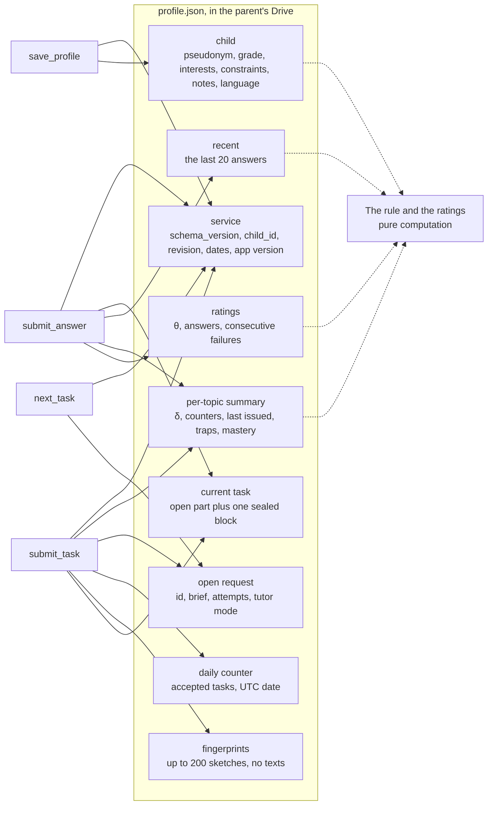

# 04. The profile file: what is in it

> Task T09 of [RUN.md](../../RUN.md). Sources: [PRODUCT-V1.md](../../PRODUCT-V1.md) sections 4.4 and 5 (О-5, О-25, О-31, О-32, О-33, О-35, О-40, О-41, О-48, О-49), the prototype's [SPEC](../prototype/SPEC.md) sections 4.1, 5.6–5.8 and its `schemas/profile.json`, and the flows in [03](03-flows.md). Where the file lives in Drive, how it is found and how two writers are kept apart is T10. The Go model and the migrations are T26.

One child, one file, one place: everything the service knows sits in a JSON file in a visible folder of the parent's Drive (О-5). The service keeps nothing of its own between requests, so this file is not a cache of some server-side truth — it **is** the truth. Every tool call reads it, computes, and writes it back (03-flows).

Two properties shape the whole layout. The file has to hold everything the deterministic rule needs, in a form that does not grow without bound (О-5, О-40). And it must not give away the answer to the current task, even to a parent who opens the file in Drive and reasons about it (PRODUCT 4.4, criterion 11.3).

Field names below are the working schema; T26 fixes them in Go and ships the migrations, and T11 fixes the numbers the rule and the mastery criterion use.

## The blocks, and who writes them



A solid arrow writes, a dashed arrow reads. Every write also touches the service block, because `revision` and `updated_at` move with it. The rule and the rating formulas read and compute but own no field of their own: they are pure functions over what is here (01-context).

## What is deliberately not in the file

- **No task texts.** Past tasks are kept as fingerprints only (О-40), so a child cannot be handed the same task twice and nobody can read back what they were asked.
- **No answer in the open.** The answer, the explanations behind the wrong options, the solution and the solver live in one sealed block (О-25).
- **Nothing that identifies the parent.** No email, no Google `sub`, not even the derived identifier the limits use (02-auth): the file is found with the parent's own Drive token, so it never needs to name them. The child's UUID is random and means nothing outside this file.
- **No rank.** The five-step rank is computed from the rating when it is shown (R12, О-48).
- **No "solved today" for display.** The rhythm of practice is not shown at all (R13, О-49). The daily counter below exists only to enforce the limit and never reaches a screen.
- **No β per task.** Each task is solved by one child and never reused, so its difficulty is derived from the task's level when the answer is recorded and is not stored (PRODUCT 4.5).

## The schema, block by block

### Service block

| Field | Type | Written by | Why |
|---|---|---|---|
| `schema_version` | integer | every write | Which shape this file has — see "Versions and migrations" |
| `child_id` | UUID string | created once | A permanent identifier so the profile can be moved to the paid edition, and it goes into the export (О-41) |
| `created_at`, `updated_at` | RFC 3339 UTC | every write | When the profile was made and last changed |
| `revision` | integer | every write | Incremented on every write; T10 pairs it with Drive's own revision id to catch two tabs writing at once |
| `app_version` | string | every write | The build that last wrote the file, for reading a broken file later |

### The child

| Field | Type | Limit | Why |
|---|---|---|---|
| `pseudonym` | string | 32 characters, no control characters, any script | A pseudonym only — no name, birth date or school (PRODUCT 5). It must never reach the task text, which stays a rule of the instructions with no programmatic check (О-36) |
| `grade` | integer 1–6 | — | The level the catalogs and the readability thresholds are chosen by |
| `interests` | array of strings | 10 items, 40 characters each | The settings the rule rotates through |
| `excluded_skills` | array of catalog ids | 15 (the catalog's size) | What must appear neither in the wording nor in a trap |
| `notes` | string | **500 characters** | Free-form context about the child, passed to the chat's model as tone and level (О-31). It is in every generation package, so the cap is a size budget as much as a privacy one; it never affects the rule |
| `ui_language` | BCP 47 tag or null | — | The parent's override of the interface language; null means the host's language (О-14) |

### Ratings

| Field | Type | Why |
|---|---|---|
| `ratings.theta` | number | θ, the child's level (PRODUCT 4.5) |
| `ratings.answers` | integer | How many answers went into θ: the `n` of the decaying step, and — see below — the counter the interest rotation uses |
| `ratings.consecutive_failures` | integer | Wrong answers in a row; the rule's switch between consolidating and moving on. A skipped task leaves it alone: there was no answer to learn from |

### The per-topic summary

One entry per topic the child has ever been given, keyed by the catalog's topic id. This is the part that is never pruned — it is the summary that lets the history window stay short (О-5, О-40).

| Field | Type | Why |
|---|---|---|
| `delta` | number | δ, the per-topic correction |
| `answers`, `correct` | integers | The `n` of the step, and the success count the progress screen shows |
| `last_issued` | date | "The topic not seen for the longest" in the rule; absent means never issued, which the rule puts first. Written when a task is **accepted**, not when the rule picks the topic — a generation that never produced anything must not push its topic away |
| `top_streak` | integer | Correct answers in a row at the upper edge of the corridor with no hint — the automatic mastery criterion (О-32). T11 sets the length and the reset |
| `mastered_since` | date or null | Set when `top_streak` reaches the criterion; the progress screen reads it |
| `traps` | map of trap id → count | How often this child fell for each trap in this topic. The rule picks the two most frequent (prototype 5.7), and the progress screen draws the map of misconceptions from the same numbers (T57a) |

### The history window

`recent` — the last **20** answers, oldest first. It exists for two readers: the progress screen's "recent answers" (PRODUCT 4.2), and the rule, which needs the topic of the last answer when it decides to consolidate.

| Field | Type | Why |
|---|---|---|
| `task_id` | string | Ties an entry to the fingerprint and to the log line |
| `topic`, `difficulty` | id, 1–5 | What was asked |
| `answered_at` | RFC 3339 UTC | When |
| `correct` | boolean | The only thing the rating formula reads (О-33) |
| `chosen`, `trap` | letter, trap id | Only on a wrong answer: which option and the trap behind it |
| `hint_used`, `confused` | booleans | The hint was opened, or "I don't understand" was pressed before answering. They change the next step, never the rating (О-33) |
| `pace` | `fast`, `normal`, `slow` | Measured by the server from `issued_at` to the answer, not by the client's clock |

Unlike the prototype, `correct` is never null: "I don't understand" is a button that asks for a simpler explanation, not an answer (PRODUCT 4.2), so it is a flag here rather than a third outcome. A skipped task produces no entry at all — only its fingerprint survives.

### Fingerprints of past tasks

`task_fingerprints` — an array of up to **200** opaque strings, oldest first, one per accepted task. No text, no topic, no date: eviction is "drop from the front", and the duplicate check compares a new task against all of them (T32 fixes the algorithm and the threshold; a fixed-length sketch of the normalised wording is what the size budget below assumes).

Two hundred is ten days of heavy use at twenty tasks a day. Beyond that a child does not recognise a task anyway, and criterion 11.9 — twenty tasks in a row on one topic with no duplicate refusal — lives comfortably inside the window.

### The open request

`open_request`, or null when no task is being written. Its fields are what makes "three attempts" and "one generation per request" survive a restart and a second instance (03-flows).

| Field | Type | Why |
|---|---|---|
| `id` | string | `submit_task` must carry it; anything else is `stale_request` |
| `opened_at` | RFC 3339 UTC | The abandonment window, ~15 minutes (T15) |
| `attempts` | integer 0–3 | The counter the model cannot forget its way around |
| `tutor_mode` | `rule` or `llm` | Whether the model kept the rule's topic and difficulty or chose its own with a reason — the comparison the prototype's D43 set up |
| `language` | BCP 47 tag | The language of the chat, so the task is written in it (О-14) |
| `brief` | object | The brief exactly as the model received it: goal, topic, difficulty, setting, traps, constraints, excluded skills (prototype 5.1, minus `motivate`, removed by О-34) |

### The current task

`current_task`, or null when there is none. The open part is everything the child may see; the sealed block is everything that gives the answer away.

| Field | Where | Why |
|---|---|---|
| `id` | open | `submit_answer` is keyed by it: the answer is recorded once (03-flows) |
| `issued_at` | open | The pace is measured from here |
| `topic`, `difficulty`, `language` | open | The history entry and the rating update are built from them |
| `instructions_version` | open | Which version of the instructions produced this task, so the result's log line can carry it (О-21) |
| `fingerprint` | open | Added to `task_fingerprints` when the task is accepted |
| `wording`, `drawing`, `options`, `hint` | open | Exactly what the card shows and what the model was given back |
| `sealed` | sealed | `mt1.t.<kid>.<ciphertext>` — the answer, the trap id and the explanation behind each wrong option, the solution and the solver program |

The sealed block's plaintext is JSON with a version of its own, sealed under the `task-answer` purpose of the key ring (02-auth). It is opened in exactly one place: inside `submit_answer`, after the answer has been recorded. If it cannot be opened — the key that sealed it has been retired, which takes two rotation periods — the tool says the task can no longer be checked and clears it, and the child is given a new one (02-auth).

The solver program is kept although it is never run again: it is the record that this task was actually verified, and it could not live in the open part in any case.

### The daily counter

`daily` — `{ "date": "2026-09-20", "accepted": 7 }`. The unit is an accepted task (О-35): checked in `next_task`, incremented in `submit_task` (03-flows). It lives in the file because it must be shared by every instance (О-15, О-24), and its date is a UTC date, which is the compromise 03-flows records.

## Where the answer is, and why it cannot be deduced

The acceptance question for this task is whether someone holding the file can work out the answer. Walk the file with that in mind:

- The **correct letter** is inside the sealed block and nowhere else.
- The **explanations behind the wrong options** are sealed too, and this is the part that is easy to get wrong: four explanations in the open, keyed by letter, would name the four wrong options and hand over the fifth by elimination. So the whole option→trap→explanation map is one sealed object, not per-option fields.
- The **trap ids** of the current task are sealed for the same reason. The trap ids in the per-topic summary and in `recent` are about tasks already answered, and reveal nothing about this one.
- The **brief** in the open request names the traps the task was asked to use, which is a hint about the subject, not about which option is correct.
- The **solution** and the **solver** are sealed.
- The **history entry** with `chosen` and `trap` is written when the answer is recorded, by which time the answer is no longer a secret.
- Nothing in the open part changes shape depending on the answer: five options, one hint, one drawing, whatever the correct letter is. The sealed block is one opaque string, so its length says nothing that matters.

One limitation stays, and it is deliberate (О-27): the adult who reads the host's own tool-call log sees the task the model submitted, answer included. That is outside the threat model and is described in the privacy policy (T19). The sealing protects against automated reading and against the same task being handed out twice — not against a parent who goes looking.

## What the rule needs, and where it reads it

The check for this task is that the prototype's rule (its SPEC 5.7) can be computed from the summary and the window alone — never from the full history, which we do not keep.

| Step of the rule | Read from |
|---|---|
| A failure to consolidate? | `ratings.consecutive_failures` |
| Which topic to consolidate | the last entry of `recent` — never empty while `consecutive_failures` is above zero |
| Otherwise: an unmastered topic of this grade, unseen for the longest, never-issued ones first | `topics[*].mastered_since`, `topics[*].last_issued`, `child.grade`, and the topic catalog in the binary |
| The recommended difficulty, from the corridor | `ratings.theta`, `ratings.answers`, `topics[t].delta`, `topics[t].answers` |
| The setting, rotated through the interests | `child.interests` and **`ratings.answers`** |
| The two traps | `topics[t].traps`, topped up from the reference tasks of that topic in the binary |
| The prohibitions carried into the brief | `child.excluded_skills` |

One substitution is worth naming. The prototype rotates the setting by the number of history entries; with a bounded window that number would start repeating as soon as entries are dropped, and the rule would stop being deterministic in the way D40 promises. The total answer count does the same job and never goes backwards.

## Size, and the window policy

Pretty-printed JSON with sorted keys, not a compact line: the parent can open this file (PRODUCT 5), Drive shows its revisions, and both are worth more than the twenty per cent the whitespace costs.

| Block | Typical | Near the caps |
|---|---|---|
| Service and child | 0.6 KB | 1.5 KB |
| Ratings and the per-topic summary, 30 topics | 8 KB | 14 KB |
| `recent`, 20 entries | 4 KB | 5 KB |
| `task_fingerprints`, 200 entries | 11 KB | 13 KB |
| The open request | 0 or 1.5 KB | 2 KB |
| The current task, open part | 2 KB | 4 KB |
| The current task, sealed block | 4 KB | 8 KB |
| **Total** | **≈ 30 KB** | **≈ 48 KB** |

The soft target is 64 KB and the hard cap 256 KB. The caps that keep it there are the ones above — 500 characters of notes, 20 recent answers, 200 fingerprints, 30-odd topics — and they are enforced on every write, not checked afterwards. If a file still approaches the hard cap, it is pruned in this order, and the order is the point: **fingerprints first** (a rarer repeat), **then the history window** (a shorter "recent answers" list), and **never** the per-topic summary or the current task, because those are what the rule and the lesson run on.

What grows without a bound of its own is the per-topic summary, which gains an entry per topic the child ever touches. With the catalogs of PRODUCT 4.6 that is a few dozen entries at most, and a topic that leaves the catalog leaves the summary with the next write.

## Versions and migrations

`schema_version` is an integer; v1 is the shape above.

- **Reading an older version** runs the migration chain in memory — pure functions, one per step, each with its golden file in `testdata/` (T26). The next write stores the current version.
- **Reading a newer version** is refused: the instance does not touch the file and tells the model that the profile was saved by a newer version of the service and to try again shortly. This is not hypothetical — two revisions are live during every Cloud Run rollout, and an old instance rewriting a new file would quietly drop whatever it did not understand.
- **Adding an optional field** is not a version bump. Removing one, renaming one, or changing what one means is.
- **The sealed block carries its own version** inside the ciphertext and is migrated or dropped on its own: a task in flight is worth less than a profile.
- Unknown fields at the current version are ignored on read and are not written back — forward compatibility is the refusal above, not a bag of leftovers.

## An example

```json
{
  "app_version": "1.0.0+7c2f1ab",
  "child": {
    "excluded_skills": ["division_with_remainder"],
    "grade": 3,
    "interests": ["space", "dinosaurs", "football"],
    "notes": "Reads slowly and re-reads the question twice. Loves anything about planets. Gets discouraged by long wordings.",
    "pseudonym": "Otter",
    "ui_language": null
  },
  "child_id": "f1c0e6e2-2d1a-4a19-9a8f-0f0b6b2f9a31",
  "created_at": "2026-06-02T18:04:11Z",
  "current_task": {
    "difficulty": 3,
    "fingerprint": "Zr8k1Qe7wq2YvN0hJ5tBb3xS9dP6mLcA4uKfR1oGiE0",
    "hint": "Try listing the crews one by one, starting with the youngest cadet.",
    "id": "tsk_01J9Z2K7Q4",
    "instructions_version": "8f21c04",
    "issued_at": "2026-09-20T19:12:40Z",
    "language": "en-US",
    "options": {
      "A": "4",
      "B": "6",
      "C": "8",
      "D": "10",
      "E": "12"
    },
    "sealed": "mt1.t.kQ7fWx.5rJ0Yb2mQ8vK1nT4pXc9LdZ6hA3sEuR7gFiO2wMbN5jV8yC1tGqH4kSxP0zD...",
    "topic": "combinatorics.enumeration",
    "wording": "Three cadets take turns steering the shuttle. Each shift is taken by exactly one cadet, and nobody takes two shifts in a row. In how many different orders can the three shifts be taken?"
  },
  "daily": {
    "accepted": 7,
    "date": "2026-09-20"
  },
  "open_request": null,
  "ratings": {
    "answers": 57,
    "consecutive_failures": 1,
    "theta": 0.42
  },
  "recent": [
    {
      "answered_at": "2026-09-20T18:44:02Z",
      "correct": true,
      "difficulty": 3,
      "hint_used": false,
      "confused": false,
      "pace": "normal",
      "task_id": "tsk_01J9Z1R8M2",
      "topic": "logic.truth_tellers"
    },
    {
      "answered_at": "2026-09-20T19:02:55Z",
      "chosen": "B",
      "confused": false,
      "correct": false,
      "difficulty": 3,
      "hint_used": true,
      "pace": "slow",
      "task_id": "tsk_01J9Z2A1B7",
      "topic": "combinatorics.enumeration",
      "trap": "missed_case"
    }
  ],
  "revision": 41,
  "schema_version": 1,
  "task_fingerprints": [
    "Ab3kR9wQ2eT7yU1iO5pA8sD4fG6hJ0kL3zX7cV9bN2m",
    "Qw8eR2tY6uI0oP4aS7dF1gH5jK9lZ3xC6vB8nM2mQ4w"
  ],
  "topics": {
    "arithmetic.with_a_twist": {
      "answers": 12,
      "correct": 11,
      "delta": 0.55,
      "last_issued": "2026-09-14",
      "mastered_since": "2026-09-14",
      "top_streak": 5,
      "traps": {
        "off_by_one": 1
      }
    },
    "combinatorics.enumeration": {
      "answers": 9,
      "correct": 7,
      "delta": 0.31,
      "last_issued": "2026-09-20",
      "mastered_since": null,
      "top_streak": 0,
      "traps": {
        "double_count": 1,
        "missed_case": 3
      }
    },
    "logic.truth_tellers": {
      "answers": 6,
      "correct": 4,
      "delta": -0.18,
      "last_issued": "2026-09-20",
      "mastered_since": null,
      "top_streak": 1,
      "traps": {
        "negation_slip": 2
      }
    }
  },
  "updated_at": "2026-09-20T19:12:40Z"
}
```

The sealed string and the fingerprints are shortened here; everything else is the real shape. Topic, trap and skill ids come from the catalogs in the binary (PRODUCT 4.6) and are validated on every write — a profile that names something the catalogs do not have is a profile the rule cannot run on.

## Notes for PRODUCT/SPEC

1. **The notes cap is a token budget, not only a privacy one.** 500 characters of free-form context travel to the model in every generation package. If T36 finds the package tight, this is the first number to revisit. **For:** T36, T15.
2. **The fingerprint's shape is assumed, not decided.** The size budget above assumes one fixed-length sketch per task, around 32 bytes. If T32 needs something bigger — several sketches per task, say — the 200-entry window shrinks accordingly. **For:** T12 and T32.
3. **The solver program in the sealed block is the one field kept for no runtime reason.** It is roughly 2 KB of the file. If the size budget ever binds, dropping it after acceptance costs nothing at runtime. **For:** T12.
4. **A newer `schema_version` stops a write.** During a rollout that means a parent can briefly get "try again shortly" instead of a task. The alternative — letting an old instance rewrite a new file — loses data silently. **For:** T15, and one line in the troubleshooting text of T19.
5. **`top_streak` and `mastered_since` are fields without numbers yet.** The length of the run, what counts as the upper edge of the corridor and what resets it are О-32's, and T11 sets them. **For:** T11.
6. **The per-topic summary is the only unbounded block.** It grows with the catalog, not with use, so it is bounded in practice — but if the grade 5–6 catalogs (О-12а) turn out much larger than the current ten topics, the size table above needs redoing. **For:** T11.
