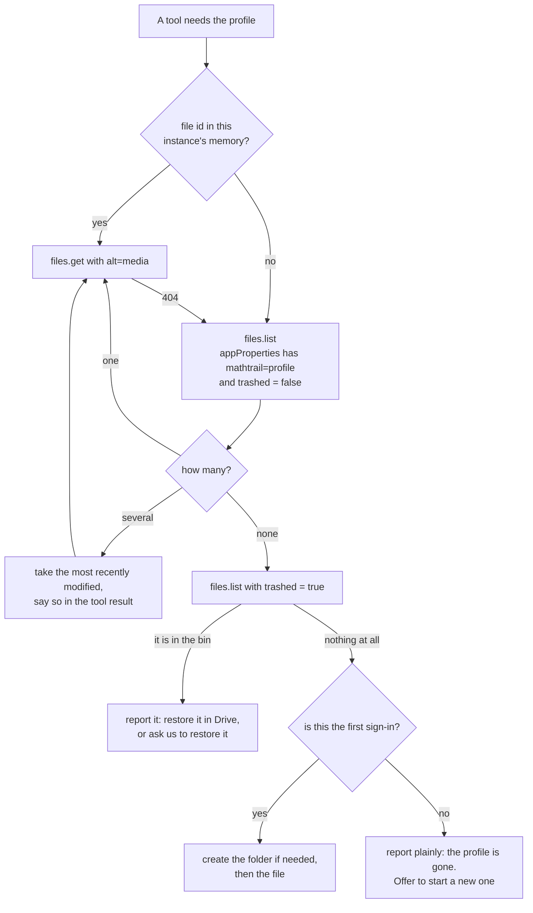
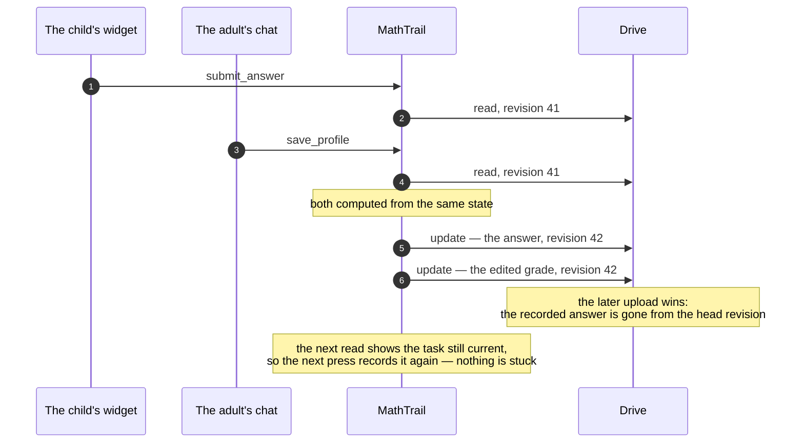

# 05. The profile in Drive

> Task T10 of [RUN.md](../../RUN.md). Sources: [PRODUCT-V1.md](../../PRODUCT-V1.md) sections 5, 6, 9.3, 9.4 and criterion 11.4 (О-5, О-15, О-24); the file's contents are [04](04-profile.md), the flows that read and write it are [03](03-flows.md), and the token that authorises every call is [02](02-auth.md). Implemented in T40 (the interface and the in-memory store), T50 (the Drive store) and T51 (conflicts and failures).

The profile file is the only durable thing the service has, and it lives in the parent's Google Drive under the `drive.file` scope — a visible folder, a file the parent can open, a bin and a revision history they control (О-5). "Losing the profile is unacceptable" (PRODUCT 5) has to hold on top of an API that offers no conditional write, so most of this document is about what happens when something goes wrong.

## What the API gives us, and what it does not

Read on 2026-09-20 from the Drive API v3 documentation, not from memory:

- **There is no conditional write.** `files.update` takes `addParents`, `removeParents`, `keepRevisionForever`, `ocrLanguage`, `uploadType` and the sharing-related parameters — and no `If-Match`, no etag precondition, no expected-version parameter. Whoever uploads last wins, silently. Everything in "Two tabs" below follows from this one fact.
- **The file resource carries `version` and `headRevisionId`.** `version` is "a monotonically increasing version number for the file. This reflects every change made to the file on the server, even those not visible to the user"; `headRevisionId` is "the ID of the file's head revision… currently only available for files with binary content", which a JSON file is.
- **Revisions are short-lived by default.** "Purgeable revisions are typically preserved for 30 days, but can be purged earlier if a file has 100 revisions that aren't designated as 'Keep Forever' and a new revision is uploaded." A revision can be pinned with `keepForever`, and "up to 200 revisions can be set to 'Keep Forever'". At three writes per task, a hundred revisions is about a day and a half of use — so the recovery history we rely on has to be pinned deliberately.
- **`appProperties` are private to us and searchable.** At most "30 private properties per file from any one application" and "124 bytes per property string (including both key and value) in UTF-8". The query form is `appProperties has { key='KEY' and value='VALUE' }`, combined with `trashed = false` and `spaces=drive`.
- **Quotas are not our problem, rate limits might be.** 1,000,000 units per minute per project and 325,000 per user; over the limit it is `403 userRateLimitExceeded` or `429`, and the documented answer is truncated exponential backoff with jitter. Standard use is free today, with charges for overage "planned… later in 2026".

## The layout

| What | Value | Why |
|---|---|---|
| Folder | `MathTrail` in My Drive, created by us | The parent can see it, open it, and see what is stored about their child (PRODUCT 5) |
| File | `mathtrail-profile.json`, MIME type `application/json` | One child per account in the free edition (PRODUCT 3), so one file |
| Marker | `appProperties: {"mathtrail": "profile", "schema": "1"}` | How the file is found |
| Folder marker | `appProperties: {"mathtrail": "folder"}` | How the folder is found when a new file has to be created |

Under `drive.file` we can only ever see files this app created, so the marker search is narrow by construction and cannot match a file of the parent's own — the documentation does not spell this out for `files.list`, so T50 asserts it against the fake Drive and T53 confirms it on a real account.

**The marker is the identity, not the path.** The parent may rename the file, drag it out of our folder, or tidy it into a folder of their own, and the next search still finds it. The folder is a courtesy to whoever opens Drive, not something the service depends on; if it is missing when a file has to be created, it is created again.

The schema version is duplicated into `appProperties` so that a future edition can tell what it is looking at before downloading anything. The authoritative copy stays inside the file (04-profile).

## Finding the profile

The four outcomes are the four things that actually happen to a file in somebody's Drive: it is there, there are somehow two of them, it is in the bin, or it has been emptied out of it. None of them is allowed to produce a stack trace or a silently new, empty profile — starting over is something the parent asks for, never something the service decides (PRODUCT 5).

Two files match only after an unusual sequence — the file was trashed, a new one was made, the old one was restored — and merging them automatically would be guesswork. The newest by `modifiedTime` wins, and the tool result says so, so the parent can delete the other.

## One read, one write, nothing slow in between

Every tool call is read → compute → write (03-flows). The cost in HTTP calls:

| Tool | Cold instance | File id already cached |
|---|---|---|
| `get_profile`, `get_progress` | 2 — `files.list`, `files.get(alt=media)` | 1 — `files.get(alt=media)` |
| `save_profile`, `next_task`, `submit_task`, `submit_answer` | 3 — list, get, `files.update` | 2 — get, update |
| First sign-in, no file yet | 3–4 — list (miss), the bin check, the folder, `files.create` multipart | — |
| A pinned write — every fiftieth, or the first of a day | +2 — `revisions.list`, release the oldest pin | same |

A whole task — `next_task`, `submit_task`, `submit_answer` — costs six Drive calls on a warm instance. Every response asks for a narrow `fields` list, so nothing but the few fields we use crosses the wire.

The file id is cached in the instance's memory, keyed by the user identifier from 02-auth. It is a cache in the strict sense: a stale id produces a `404`, which falls back to the search. Nothing durable is keyed by that identifier, which 02-auth requires.

**A read straight after a write may arrive early.** Drive does not promise that the next read sees the revision just written, and the lesson makes exactly that call pattern: the widget records an answer and the model asks for the next task a second later. So the cache holds one more thing beside the file id — **the `revision` this instance last wrote**. If a read comes back with a lower `revision` than that, the instance reads once more after about 250 ms; if the second read is still behind, it proceeds from **its own** last written state, which cannot be older than what Drive is serving. The case is logged, because a stale read that happens often would mean something else is wrong.

This is per instance and makes no promise across them: a second instance reading an early copy sees what Drive gives it. That is the same window the two-tab race lives in, and the same four measures cover it.

**The rule that matters more than the budget: nothing slow may happen between the read and the write.** Every check that does not need the profile — the structure, the Starlark solver, the readability, the drawing — runs *before* the profile is read; only the near-duplicate check needs it, and it is a comparison against fingerprints already in hand. The read-modify-write window is therefore microseconds of pure computation rather than the second or more a solver can take. This is not a micro-optimisation: with no conditional write, that window *is* the race, and shrinking it is most of the protection we can buy.

## Two tabs, and what Drive cannot do for us

What the service does about it, in order of how much it buys:

1. **It shrinks the window** to the duration of one upload, as above.
2. **Every operation is idempotent and re-appliable.** The open request is keyed by its id, the answer by the task id, and each is a pure function of the state it reads (03-flows). So a retry is safe, and — importantly — a retry recomputes from the *fresh* state instead of replaying a stale byte image.
3. **A failed or suspicious write is retried by re-reading and re-applying**, up to three times with jittered backoff, never by uploading the same bytes again.
4. **Losses are self-healing.** A lost answer leaves the task current, so the child's next press records it. A lost open request makes `submit_task` answer `stale_request`, and the model asks for a task again. A lost profile edit is one edit the parent can make again — and in each case the overwritten state is still in Drive's revision history.

**The window that remains** is one round trip wide: two uploads that overlap between the moment each is sent and the moment Drive commits it. Nothing in the API lets us detect that after the fact — the head revision simply holds whichever arrived last, and we cannot ask Drive "was the revision before mine the one I read?" without walking the revision list on every write, which costs a call per write to catch an event that needs two people acting inside the same few hundred milliseconds. So it is accepted, written down here, and covered by the four points above rather than prevented. T51 tests it explicitly, with two writes racing against a fake Drive.

## When the file is damaged

Damaged means the download does not parse as JSON, or parses but fails validation — an unknown schema version is *not* damage and has its own answer (04-profile).

1. **Look back through the revisions.** One `revisions.list`, then at most five bodies fetched with `revisions.get(alt=media)`, newest first, until one parses and validates. The five are **the four newest revisions plus the newest pinned one** — never simply the last five. The difference matters exactly when it is needed: a fault that writes six broken states in a row would push every pinned snapshot out of a five-deep window, and the one revision that is guaranteed to still exist is the pinned one.
2. **Restore it forward**, as a new revision — nothing is deleted, so a mistaken recovery is itself recoverable — and say plainly what happened: the file was damaged, this is the state from such-and-such a date, and anything answered after it is gone.
3. **If nothing parses**, stop. The service does not overwrite a file it cannot read. The tool result names the file and the folder and offers two ways out: restore an older version from Drive's own version history, which the parent can do themselves, or start a new profile — which sets the damaged file aside rather than deleting it: renamed, and marked as set aside instead of as the profile, so that the search for the profile finds only the new one while the old one can still be found. An instance that still holds the old file id must not read it as the profile.

**Keeping enough history to recover from.** Drive purges unpinned revisions once there are a hundred of them, which at three writes per task is about a day and a half. So some writes are pinned with `keepRevisionForever=true` — a query parameter on the update we were making anyway, so it costs nothing — and **two independent triggers** decide which:

- **every fiftieth write**, by the file's own `revision` counter — ours, not Drive's `version`, and it moves by exactly one per successful write;
- **the first write of a new day**, seen by comparing the date of the `updated_at` already in the file with today's. No new field, and no arithmetic that can drift.

Two triggers because one of them can be skipped. A write lost in the race above takes its revision number with it, and a counter that only ever fires on an exact multiple is a counter that can miss; the calendar trigger cannot miss more than a day. The recovery window above and these two triggers are one decision, R17: neither half is worth much without the other. That leaves a snapshot roughly every seventeen tasks, and the two-hundred-pin ceiling is far away; when the pinned set reaches a hundred, the oldest pins are released during the same fiftieth write. A pinned revision is a full copy against the parent's own Drive quota — a hundred of them is about three megabytes, which is not a number anybody will notice. Recent history stays unpinned and purgeable, which is exactly right: the day-old states are the ones worth keeping, and the minute-old ones are still in the head.

## When the file is gone

| What happened | What the service does |
|---|---|
| In the bin | The search excludes trashed files, so it looks missing; a second search with `trashed = true` finds it, and the tool result says where it is. It is restored on the parent's say-so, not on ours |
| Emptied out of the bin | Unrecoverable — the one irreversible loss in the product. The tool says so plainly and offers to start a new profile. It belongs in the FAQ that goes with the privacy policy (T19) |
| Signed in with a different Google account | The search runs in that account's Drive and finds nothing, which looks exactly like a missing profile. The tool result names the signed-in account so the parent can spot it |
| The parent revoked the app's access | Drive answers 401 or 403; we answer 401 with a `WWW-Authenticate` challenge and the host starts a new sign-in (02-auth) |
| The parent deleted our folder but kept the file | Found by its marker anyway; the folder is recreated the next time a file has to be created |

## When Drive says no

| Answer | What it means | What we do |
|---|---|---|
| `403 userRateLimitExceeded`, `429` | Too many calls for this user or project | Two retries, at about 0.5 s and 1.5 s with jitter, then a clear message that the model relays. Drive's own advice is backoff up to 32 seconds, which no chat host will wait for — so this is a short attempt at riding out a blip, not a strategy for a real block. It should never fire: at 325,000 quota units a minute per user and six calls per task, a persistent `429` means our call budget is wrong, so it is counted as its own metric (T60) rather than quietly retried |
| `5xx` | Drive is having a moment | The same two retries, and the same counter |
| `403 storageQuotaExceeded` | The parent's Drive is full | No retry helps. The message has to be specific — the answer was **not** recorded and the Drive needs space — because this is the one failure where the child did something and it did not stick |
| `404` on a cached id | The file moved out from under the cache | Drop the cache entry and search again |
| `401`, `invalid_grant` | The grant is gone | A 401 with a challenge, as above |

Internal error text never reaches the model or the parent; what goes back is a short sentence about what happened and what to do (CLAUDE.md, "Errors"). The failure is logged once, at the boundary, with no file contents in it.

## The daily counter with several instances

Both daily counters — accepted tasks and failed generations (04-profile) — live in the file precisely so that instances share them (О-15, О-35, R15). Two acceptances that overlap in the window above can both increment from the same value, and one increment is lost — the limit is then looser by one for that day. That is the same trade О-24 already made for the request rate, which is counted per instance and can be several times looser; an exact counter needs shared storage, and shared storage is what v1 does not have. Both counters are cost ceilings, not accounting records, and a family that gets one extra task is not a problem to solve with Redis.

## Export

The export is the file. It is JSON, it is in the parent's own Drive, in a folder they can see, and they can download or copy it like any other file — which is most of why О-5 put it there rather than in the app's hidden folder. The profile tool answers "where is my child's data" by naming the folder and the file and describing what is inside; there is no separate export format and no second copy to keep in step. The child's permanent UUID travels in it (О-41), so a future paid edition can take the file as it stands.

## Coverage: PRODUCT 5 and criterion 11.4

| Requirement | Where |
|---|---|
| 5 A JSON file in a visible folder, `drive.file` (О-5) | "The layout" |
| 5 Protection against simultaneous writes from two tabs | "Two tabs", all four measures and the remaining window |
| 5 A comprehensible recovery from a corrupted file | "When the file is damaged" |
| 5 Profile export | "Export" |
| 5 Defined behaviour if the parent revokes access or deletes the file | "When the file is gone", "When Drive says no" |
| 6 Several instances, nothing shared (О-24) | "The daily counter with several instances"; the file id cache is per instance and disposable |
| 9.3 `drive.file`, a non-sensitive scope | 02-auth; nothing here needs a wider one |
| 9.4 Minimise reads and writes per request | "One read, one write": the budget table |
| 11.4 The profile survives a service restart | Nothing but caches lives in memory; the file id cache falls back to a search |
| 11.4 The profile survives a repeat sign-in | The file is found by its marker, not by a path or a remembered id, so a new token finds the same file — in the same Google account |
| 11.4 The profile survives two tabs at once | "Two tabs" |
| 11.4 The profile survives a read that arrives before the write it should see | "One read, one write": the instance remembers the revision it last wrote and never steps backwards from it |
| 11.4 A corrupted file recovers comprehensibly | "When the file is damaged" |

## Notes for PRODUCT/SPEC

1. **The unrecoverable case is one line in the FAQ.** If the parent empties the Drive bin, the profile is gone — no server-side copy exists, by design. Worth saying out loud next to the privacy policy, because "we store nothing" and "we cannot get your data back" are the same sentence read from two sides. **For:** T19.
2. **The retry budget is bounded by the host, not by Drive.** Drive's own advice is backoff up to 32 seconds; a chat host will have given up long before. Two short retries — 0.5 s and 1.5 s — and then a clear message is the compromise, and the honest reading is that a real rate-limit block is not something the service can ride out at all. That is why a persistent `429` is a metric rather than a retry loop. **For:** T15, T51, T60.
3. **Pinning every fiftieth revision is a number, not a law**, and it now has a calendar trigger beside it so that a missed multiple cannot cost a whole history. Both follow from three writes per task and Drive's hundred-revision purge; if the write count per task changes, they change with it. **For:** T51.
4. **`storageQuotaExceeded` deserves its own message and its own test**: it is the only failure where the child acted and the result was not saved. **For:** T51, and the wording in T15.
5. **Two profile files is a state we report but never merge.** If it turns out to happen in practice, merging deserves a decision rather than an improvisation. **For:** T51, and a live check in T62.
6. **The `schema` in `appProperties` is a convenience copy.** It must be written on every update that changes the schema version, or it will drift from the file. **For:** T50.
7. **Drive's consistency after a write is assumed, not documented.** The guard above — remember the revision just written, re-read once, then trust our own copy — is written against the possibility, not against a measurement. T51 fakes an early read in a test, and T53 is the first place a real one could show up. **For:** T51, T53.
