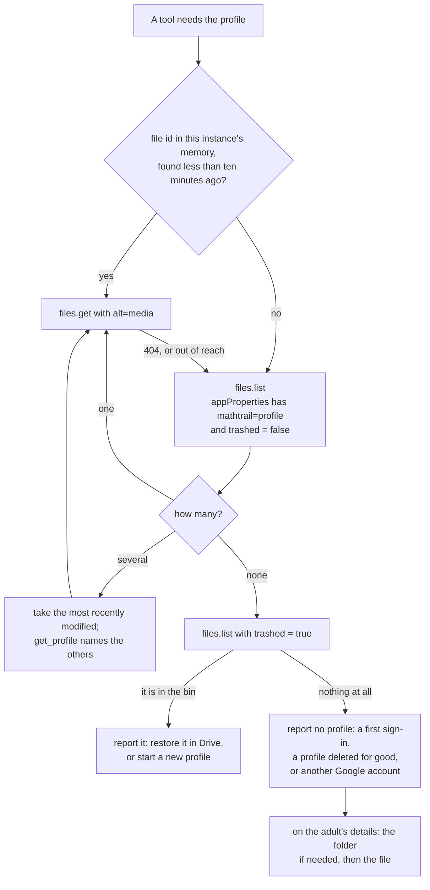
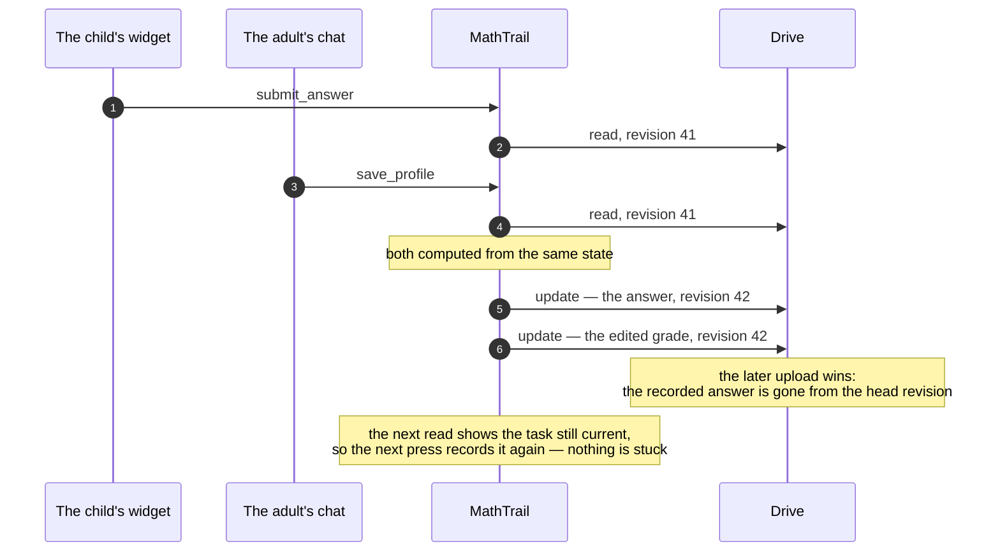

# 05. The profile in Drive

> Task T10 of [RUN.md](../../RUN.md). Sources: [PRODUCT-V1.md](../../PRODUCT-V1.md) sections 5, 6, 9.3, 9.4 and criterion 11.4 (О-5, О-15, О-24); the file's contents are [04](04-profile.md), the flows that read and write it are [03](03-flows.md), and the token that authorises every call is [02](02-auth.md). Implemented in T40 (the interface and the in-memory store), T50 (the Drive store) and T51 (conflicts and failures).

The profile file is the only durable thing the service has, and it lives in the parent's Google Drive under the `drive.file` scope — a visible folder, a file the parent can open, a bin and a revision history they control (О-5). "Losing the profile is unacceptable" (PRODUCT 5) has to hold on top of an API that offers no conditional write, so most of this document is about what happens when something goes wrong.

## What the API gives us, and what it does not

Read on 2026-09-20 from the Drive API v3 documentation, not from memory:

- **There is no conditional write.** `files.update` takes `addParents`, `removeParents`, `keepRevisionForever`, `ocrLanguage`, `uploadType` and the sharing-related parameters — and no `If-Match`, no etag precondition, no expected-version parameter. Whoever uploads last wins, silently. Everything in "Two tabs" below follows from this one fact.
- **The file resource carries `version` and `headRevisionId`.** `version` is "a monotonically increasing version number for the file. This reflects every change made to the file on the server, even those not visible to the user"; `headRevisionId` is "the ID of the file's head revision… currently only available for files with binary content", which a JSON file is.
- **Revisions are short-lived by default.** "Purgeable revisions are typically preserved for 30 days, but can be purged earlier if a file has 100 revisions that aren't designated as 'Keep Forever' and a new revision is uploaded." A revision can be pinned with `keepForever`, and "up to 200 revisions can be set to 'Keep Forever'". At three writes per task, a hundred revisions is about a day and a half of use — so the recovery history we rely on has to be pinned deliberately.
- **A pinned revision stays pinned, and only a pinned one can be read.** "Once a blob file revision is set to 'Keep Forever', it can only be downloaded or deleted" — setting it back is refused with `illegalKeepForeverModification` — and "you can only download blob file content revisions marked as 'Keep Forever'", refused otherwise with `download_restricted_for_revision` (read on 2026-09-28). A list of a file's revisions comes in no order the API promises.
- **`appProperties` are private to us and searchable.** At most "30 private properties per file from any one application" and "124 bytes per property string (including both key and value) in UTF-8". The query form is `appProperties has { key='KEY' and value='VALUE' }`, combined with `trashed = false` and `spaces=drive`.
- **Quotas are not our problem, rate limits might be.** 1,000,000 units per minute per project and 325,000 per user; over the limit it is `403 userRateLimitExceeded` or `429`, and the documented answer is truncated exponential backoff with jitter. Standard use is free today, with charges for overage "planned… later in 2026".

## The layout

| What | Value | Why |
|---|---|---|
| Folder | `MathTrail` in My Drive, created by us | The parent can see it, open it, and see what is stored about their child (PRODUCT 5) |
| File | `mathtrail-profile.json`, MIME type `application/json` | One child per account in the free edition (PRODUCT 3), so one file |
| Marker | `appProperties: {"mathtrail": "profile", "schema": "1"}` | How the file is found |
| Folder marker | `appProperties: {"mathtrail": "folder"}` | How the folder is found when a new file has to be created |

Under `drive.file` we can only ever see files this app created, so the marker search is narrow by construction and cannot match a file of the parent's own. The search guide says so for `files.list` as well — under `drive.file` it returns only the files the app can access (read on 2026-09-28) — and T50 holds the store to it against the stand-in Drive: a file of the parent's own, named and placed like the profile, is never taken for it. T53 confirms it on a real account.

**The marker is the identity, not the path.** The parent may rename the file, drag it out of our folder, or tidy it into a folder of their own, and the next search still finds it. The folder is a courtesy to whoever opens Drive, not something the service depends on; if it is missing when a file has to be created, it is created again.

The schema version is duplicated into `appProperties` so that a future edition can tell what it is looking at before downloading anything. The authoritative copy stays inside the file (04-profile).

## Finding the profile

```mermaid
flowchart TD
    start["A tool needs the profile"] --> cache{"file id in this instance's memory,<br/>found less than ten minutes ago?"}
    cache -- yes --> get["files.get with alt=media"]
    cache -- no --> search["files.list<br/>appProperties has mathtrail=profile<br/>and trashed = false"]
    get -- "404, or out of reach" --> search
    search --> found{"how many?"}
    found -- "one" --> get
    found -- "several" --> newest["take the most recently modified;<br/>get_profile names the others"]
    found -- "none" --> bin["files.list with trashed = true"]
    newest --> get
    bin -- "it is in the bin" --> ask["report it: restore it in Drive,<br/>or start a new profile"]
    bin -- "nothing at all" --> none["report no profile: a first sign-in,<br/>a profile deleted for good,<br/>or another Google account"]
    none --> create["on the adult's details: the folder<br/>if needed, then the file"]
```

The four outcomes are the four things that actually happen to a file in somebody's Drive: it is there, there are somehow two of them, it is in the bin, or it has been emptied out of it. None of them is allowed to produce a stack trace or a silently new, empty profile — starting over is something the parent asks for, never something the service decides (PRODUCT 5). The last one cannot be told from a first sign-in, since the service keeps nothing of its own, so the answer says all of them: no profile yet, or one deleted for good, or one in another Google account.

Two files match only after an unusual sequence — the file was trashed, a new one was made, the old one was restored — and merging them automatically would be guesswork. The newest by `modifiedTime` wins, and `get_profile` and the progress name the others, so the parent can delete them (R120, R147).

## One read, one write, nothing slow in between

Every tool call is read → compute → write (03-flows). The cost in HTTP calls, as T50 and T51 built it and their budget tests hold every tool to:

| Tool | Cold instance | File id already cached |
|---|---|---|
| `get_profile`, `get_progress`, `read_progress` | 4 — list, get; then list and the folder's name, for where the file is | 3 — get; list and the folder's name |
| `save_profile`, `edit_profile`, `next_task`, `prepare_task`, `submit_task`, `take_task`, `submit_answer` | 4 — list, get, get again, `files.update` | 3 — get, get again, update |
| `get_package`, `read_task` — the package, and each question the card of a task asks while it waits (R152) | 2 — list, get | 1 — get |
| A call that writes nothing — a request already open, nothing to write ahead, a take told again, an answer told again, an edit that changes nothing | as a read | as a read |
| No profile yet: `get_profile` | 2 — list (miss), the list of the bin (miss) | — |
| First sign-in, no file yet | 7 — list and the list of the bin (misses); then the same two again before the creation, the search for the folder, the folder, `files.create` multipart; 6 when the folder is there | — |
| The first write of a day | nothing more: the upload asks for its revision to be kept, and is made again without when Drive keeps no more (R214) | same |
| Putting a damaged file back, `save_profile` with `restore` | a read, `revisions.list`, a `revisions.delete` for each kept revision past the room the recovery needs, and for each revision tried a `revisions.update` to keep it and a `revisions.get`; then a get and the upload | same |
| A write refused as a conflict and made again | a read and a write more, at most twice | same |

The second get is the check "Two tabs" below turns on: a write reads the file once more and compares it with what it was computed from, because Drive has no conditional write (R116). A whole task — `next_task`, `get_package`, `submit_task`, `submit_answer` — costs ten Drive calls on a warm instance, and each question the card asks while it waits one more: about fifteen for a minute's wait (R152). A task written ahead costs as many — `prepare_task`, `submit_task`, `take_task` or `next_task`, `submit_answer` —, but only the three of the hand-out lie on the child's wait (R235, R236). Every response asks for a narrow `fields` list, so nothing but the few fields we use crosses the wire. The bin is looked in only when a search finds nothing. A call Drive asks to pause, or fails on its side, is made again, twice at most (below). A search for where the file is that still fails leaves the location out of the progress and the profile rather than failing them: what was read is shown, and the words say where the file is could not be found (R148).

The file id is cached in the instance's memory, keyed by the user identifier from 02-auth. It is a cache in the strict sense: a stale id produces a `404`, which falls back to the search. It is trusted for ten minutes from the search that found it, and then searched for again: Drive answers a file in the bin by its ID as it answers any other, and only a search leaves the bin out (R120). Nothing durable is keyed by that identifier, which 02-auth requires.

**A read straight after a write may arrive early.** Drive does not promise that the next read sees the revision just written, and the lesson makes exactly that call pattern: the widget records an answer and the model asks for the next task a second later. So the cache holds one more thing beside the file id — **the `revision` number this instance last wrote**, and nothing else of the profile. If a read comes back with a lower number, the instance reads once more after 250 ms; if the second read is still behind, the call is refused — "make the same call again in a moment" — and the number is let go of, so that the next call reads the file as it is: a file the parent put back to an earlier version on purpose is not refused twice (R120). Both cases are logged, `drive_stale_read`, because a stale read that happens often would mean something else is wrong.

This is per instance and makes no promise across them: a second instance reading an early copy sees what Drive gives it. That is the same window the two-tab race lives in, and the same six measures cover it.

**The rule that matters more than the budget: nothing slow may happen between the read and the write.** Every check that does not need the profile — the structure, the Starlark solver, the readability, the drawing — runs *before* the profile is read; only the near-duplicate check needs it, and it is a comparison against fingerprints already in hand. The read-modify-write window is therefore microseconds of pure computation rather than the second or more a solver can take. This is not a micro-optimisation: with no conditional write, that window *is* the race, and shrinking it is most of the protection we can buy.

## Two tabs, and what Drive cannot do for us

```mermaid
sequenceDiagram
    autonumber
    participant W as The child's widget
    participant M as The adult's chat
    participant MT as MathTrail
    participant D as Drive

    W->>MT: submit_answer
    MT->>D: read, revision 41
    M->>MT: save_profile
    MT->>D: read, revision 41
    Note over MT: both computed from the same state
    MT->>D: update — the answer, revision 42
    MT->>D: update — the edited grade, revision 42
    Note over D: the later upload wins:<br/>the recorded answer is gone from the head revision
    Note over MT: the next read shows the task still current,<br/>so the next press records it again — nothing is stuck
```

What the service does about it, in order of how much it buys:

1. **It shrinks the window** to the duration of one upload, as above.
2. **It looks before it writes.** A save reads the file once more and compares it, byte for byte by a digest, with the state it was computed from; when they differ, nothing is written and the save is refused as a conflict. A change made in between — another tab, another instance, the parent editing the file by hand — is never written over from here. It costs one call per write (R116).
3. **It takes turns within an instance.** The writes of one account go one at a time on an instance — the read again and the upload together — so two tabs served by the same instance never meet between them: the second reads what the first wrote, and is refused as a conflict (R118).
4. **Every operation is idempotent and re-appliable.** The open request is keyed by its id, the answer by the task id, and each is a pure function of the state it reads (03-flows). So a retry is safe, and — importantly — a retry recomputes from the *fresh* state instead of replaying a stale byte image.
5. **A write refused as a conflict is made again by re-reading and re-applying**, in the tool itself, up to three times, 50 to 150 ms apart at random, never by uploading the same bytes again (R118). What the other tab did is found done: the request already open, the answer already recorded, the task already accepted.
6. **Losses are self-healing.** A lost answer leaves the task current, so the child's next press records it. A lost open request makes `submit_task` answer `stale_request`, and the model asks for a task again. A lost profile edit is one edit the parent can make again — and in each case the overwritten state is still in Drive's revision history.

**The window that remains** is one round trip wide, and only between instances: two uploads from two instances that overlap between the moment each read the file again and the moment Drive commits the upload. Nothing in the API lets us detect that after the fact — the head revision simply holds whichever arrived last, and we cannot ask Drive "was the revision before mine the one I read?" without walking the revision list on every write, which costs a call per write to catch an event that needs two people acting inside the same few hundred milliseconds on two instances. So it is accepted, written down here and in SPEC 7.6, and covered by the six points above rather than prevented. T51 tests both sides of it against the stand-in Drive: on one instance, of eight saves from one revision exactly one lands; on two, two overlapping uploads both land, and the later is what the file holds.

## When the file is damaged

Damaged means the file is no profile at all — it does not parse as JSON, is cut short, is not of a profile's shape, or is larger than any profile, a megabyte, the most a profile is ever written as, and is not read at all. That is what the steps below put back — and only when the parent agrees. A read finds the damage and changes nothing: every tool tells it, `damaged`, and the model asks the adult. With their agreement it calls `save_profile` with `restore` and nothing else, which runs the steps; or `start_over`, which sets the file aside (step 3). A tool that only reads never writes, and losing what was saved after the version put back is the parent's to agree to (R214). A file that is a profile but breaks a rule of this build — a cap, a count, a field left empty — cannot be read either, but is **not** rolled back: a newer build may have written it without raising the version it needed, or the parent edited it by hand, and putting an earlier state over either would lose it. It is told as damage and left for the parent (step 3). An unknown schema version is *not* damage and has its own answer (04-profile).

0. **Make sure it is the profile.** A file this instance remembers that does not read is first searched for again by its marker: another instance may have set it aside and started a new profile in its place, and a file set aside is never read as the profile (R120).
1. **Look back through the revisions.** One `revisions.list`, put in the order the revisions were made since Drive promises none, then at most five revisions tried, newest first, until one parses and validates. The five are **the four newest before the damage plus the newest pinned one** — never simply the last five. The difference matters exactly when it is needed: a fault that writes five broken states in a row fills the four newest, and the one revision that is guaranteed to still exist is the pinned one. Drive gives the content of a pinned revision only, so each one tried is pinned first with `revisions.update`, room made for the pins beforehand, and then fetched with `revisions.get(alt=media)` (R119).
2. **Restore it forward**, as a new revision — nothing is deleted, so a mistaken recovery is itself recoverable — unless the file changed while its history was read, in which case what it holds now counts. `save_profile` says plainly what happened: the file was damaged and has been put back to its latest earlier version that reads, and anything saved after that version is gone. It names no date: the file's version history in Drive shows it. A file that reads by the time it is asked to is never put back over: the call says so and writes nothing. A read right after may still find the damage, since Drive does not promise that it sees the write: the instance that put the file back reads it once more after a moment, and one still damaged is told as behind, once, as any early read is (R214).
3. **If nothing parses**, stop. The service does not overwrite a file it cannot read. The tool result offers two ways out: restore an older version from Drive's own version history, which the parent can do themselves, or start a new profile — `save_profile` with `start_over` — which sets the damaged file aside rather than deleting it: renamed "mathtrail-profile set aside" and the day, and marked as set aside instead of as the profile, so that the search for the profile finds only the new one while the old one can still be found (R120). Other files with the marker that cannot be read, and the ones in the bin, are set aside with it; one beside it that reads is a profile too, and stays. The new profile is made before anything is set aside, so a new start that fails halfway never leaves the account with no profile. An instance that still holds the old file id reads it as damage, and step 0 takes it to the new profile.
4. **If the history cannot be looked through**, say that. A history Drive would not list, a Drive out of reach, one too full to pin a revision in, or a revision refused for a reason the service has no word for is not a file nothing reads, and nobody is offered a new start for it.

**Keeping enough history to recover from.** Drive purges unpinned revisions once there are a hundred of them, which at three writes per task is about a day and a half. So the first write of each day is pinned with `keepRevisionForever=true` — a query parameter on the update we were making anyway, so it costs nothing — seen by comparing the day of the `updated_at` already in the file with the day of the write. No new field, and no arithmetic that can drift. It cannot miss a day: a write lost in the race above changes nothing in the file, so the next write still finds the day to pin. The day a profile is made pins nothing: its first state is the new profile, and the next day's first write pins where that day ended.

A pin cannot be let go, only deleted with its revision, and Drive keeps at most two hundred. A write deletes none: once Drive holds two hundred, it refuses the day's pin, and the upload is made again without it — the write matters more than the pin (R119). Only a recovery deletes the earliest pins, as many as the revisions it reads that are not pinned yet need room for, since it has to pin them to read them and the parent asked for it (R214). An upload whose pin Drive refuses for any reason an upload without one would not meet as well is made again without: Drive does not document how it refuses the two hundred and first. That is two hundred days of use to recover from, after which the days stop being pinned until a recovery makes room; the unpinned history Drive keeps on its own is there as before. The rule of every fiftieth write that R17 put beside the day's is dropped: on its own it can miss, and every pin it added would have spent a place for good. A pinned revision is a full copy against the parent's own Drive quota — two hundred of them is about twelve megabytes, which is not a number anybody will notice. Recent history stays unpinned and purgeable, which is exactly right: the day-old states are the ones worth keeping, and the minute-old ones are still in the head, and pinned when a recovery needs them.

## When the file is gone

| What happened | What the service does |
|---|---|
| In the bin | The search excludes trashed files, so it looks missing; a second search with `trashed = true` finds it, and the tool says it is in the bin: the parent restores it in Drive, or asks for a new start, which sets it aside where it lies so that restoring it later makes no second profile. The service restores nothing itself (R120). An instance that remembers the file reads it for up to ten minutes, and the first write it makes there is refused and sends it to the search |
| Emptied out of the bin | Unrecoverable — the one irreversible loss in the product. The service keeps nothing, so it cannot tell this from a first sign-in: the answer is the first-run one, which says a profile made before has been deleted for good or is in another Google account, and asks for the details of a new one. It belongs in the FAQ that goes with the privacy policy (T19) |
| Signed in with a different Google account | The search runs in that account's Drive and finds nothing, which looks exactly like a missing profile. The first-run answer names this among its cases; the service does not know which account it is, since the sign-in asks for no address |
| The parent revoked the app's access | Drive answers `401`, or `403` with `insufficientPermissions`. The call fails with a sentence asking the adult to connect MathTrail again, and its result carries the sign-in's challenge in `_meta["mcp/www_authenticate"]`, from which ChatGPT signs the parent in again. Every other host is answered `401` with the same challenge, from which Claude shows its Connect button in the tool card (R118, 02-auth) |
| The parent deleted our folder but kept the file | Found by its marker anyway; the folder is recreated the next time a file has to be created |

## When Drive says no

| Answer | What it means | What we do |
|---|---|---|
| `403 userRateLimitExceeded`, `rateLimitExceeded`, `429` | Too many calls for this user or project | Two retries, at about 0.5 s and 1.5 s, each spread by a quarter, then a clear message that the model relays. Drive's own advice is backoff up to 32 seconds, which no chat host will wait for — so this is a short attempt at riding out a blip, not a strategy for a real block. It should never fire: at 325,000 quota units a minute per user and nine calls per task, a persistent `429` means our call budget is wrong, so every retry is counted in the call's line, and T60 makes it a metric rather than something quietly retried |
| `5xx` | Drive is having a moment | The same two retries for a read. An upload or a creation Drive failed on may have landed, so it is not sent again: the call ends, and the next one reads what is there (R118) |
| `403 storageQuotaExceeded` | The parent's Drive is full | No retry helps. The message is specific — nothing was saved, and an answer the child just gave was **not** recorded, and the Drive needs space — because this is the one failure where the child did something and it did not stick |
| `404` on a cached id, or `403 appNotAuthorizedToFile`, `insufficientFilePermissions` | The file moved out from under the cache, or out of the service's reach | Drop the cache entry and search again |
| `401`, `403 insufficientPermissions`, `invalid_grant` | The grant is gone | A failure with the sign-in's challenge, as above |
| The Google token would end before a call could | Nothing yet — the service's own margin (R117) was not enough | No call is started; the failure carries the same challenge, and the host renews its tokens or signs in again (R118) |
| A timeout, or the caller gone | — | Never retried: the call has spent what it is given |

Internal error text never reaches the model or the parent; what goes back is a short sentence about what happened and what to do (CLAUDE.md, "Errors"). The failure is logged once, at the boundary, with no file contents in it.

## The daily counter with several instances

Both daily counters — accepted tasks and failed generations (04-profile) — live in the file precisely so that instances share them (О-15, О-35, R15). Two acceptances that overlap in the window above can both increment from the same value, and one increment is lost — the limit is then looser by one for that day. That is the same trade О-24 already made for the request rate, which is counted per instance and can be several times looser; an exact counter needs shared storage, and shared storage is what v1 does not have. Both counters are cost ceilings, not accounting records, and a family that gets one extra task is not a problem to solve with Redis.

## Export

The export is the file. It is JSON, it is in the parent's own Drive, in a folder they can see, and they can download or copy it like any other file — which is most of why О-5 put it there rather than in the app's hidden folder. `get_profile` and the two tools of the progress answer "where is my child's data" every time, by naming the folder, the file and its link, and the other files that carry a profile when there are any, at two calls more (R120, R147); there is no separate export format and no second copy to keep in step. The child's permanent UUID travels in it (О-41), so a future paid edition can take the file as it stands.

## Coverage: PRODUCT 5 and criterion 11.4

| Requirement | Where |
|---|---|
| 5 A JSON file in a visible folder, `drive.file` (О-5) | "The layout" |
| 5 Protection against simultaneous writes from two tabs | "Two tabs", all six measures and the remaining window |
| 5 A comprehensible recovery from a corrupted file | "When the file is damaged" |
| 5 Profile export | "Export" |
| 5 Defined behaviour if the parent revokes access or deletes the file | "When the file is gone", "When Drive says no" |
| 6 Several instances, nothing shared (О-24) | "The daily counter with several instances"; the file id cache is per instance and disposable |
| 9.3 `drive.file`, a non-sensitive scope | 02-auth; nothing here needs a wider one |
| 9.4 Minimise reads and writes per request | "One read, one write": the budget table |
| 11.4 The profile survives a service restart | Nothing but caches lives in memory; the file id cache falls back to a search |
| 11.4 The profile survives a repeat sign-in | The file is found by its marker, not by a path or a remembered id, so a new token finds the same file — in the same Google account |
| 11.4 The profile survives two tabs at once | "Two tabs" |
| 11.4 The profile survives a read that arrives before the write it should see | "One read, one write": the instance remembers the revision number it last wrote, reads once more after a moment, and refuses a read still behind it rather than step backwards |
| 11.4 A corrupted file recovers comprehensibly | "When the file is damaged" |

## Notes for PRODUCT/SPEC

1. **The unrecoverable case is one line in the FAQ.** If the parent empties the Drive bin, the profile is gone — no server-side copy exists, by design. Worth saying out loud next to the privacy policy, because "we store nothing" and "we cannot get your data back" are the same sentence read from two sides. **For:** T19.
2. **The retry budget is bounded by the host, not by Drive.** Drive's own advice is backoff up to 32 seconds; a chat host will have given up long before. Two short retries — 0.5 s and 1.5 s — and then a clear message is the compromise, and the honest reading is that a real rate-limit block is not something the service can ride out at all. That is why a persistent `429` is a metric rather than a retry loop. **For:** T15, T51, T60. **Done in T51:** the two retries, each counted in the call's line, and not for an upload Drive failed on (R118); the metric is T60's.
3. **Pinning every fiftieth revision is a number, not a law**, and it now has a calendar trigger beside it so that a missed multiple cannot cost a whole history. Both follow from three writes per task and Drive's hundred-revision purge; if the write count per task changes, they change with it. **For:** T51. **Done in T51:** Drive lets a pin go only by deleting its revision, so the calendar trigger alone is kept and the fiftieth write dropped, and past a hundred pins the earliest are deleted (R119). **Since T71.2** no write deletes a pin: the day's pin is kept while Drive has room, up to its two hundred (R214).
4. **`storageQuotaExceeded` deserves its own message and its own test**: it is the only failure where the child acted and the result was not saved. **For:** T51, and the wording in T15. **Done in T51:** a sentence of its own, which says the answer was not recorded (R118).
5. **Two profile files is a state we report but never merge.** If it turns out to happen in practice, merging deserves a decision rather than an improvisation. **For:** T51, and a live check in T62. **Done in T51:** `get_profile` names the others (R120); the live check is still T62's.
6. **The `schema` in `appProperties` is a convenience copy.** It must be written on every update that changes the schema version, or it will drift from the file. **For:** T50. **Done in T50:** every write carries it, whatever it said before, and names no other property, so the marker stays as Drive keeps it — Drive sets the properties an update names and keeps the others (R116).
7. **Drive's consistency after a write is assumed, not documented.** The guard above — remember the number just written, re-read once, then refuse once — is written against the possibility, not against a measurement. T51 fakes an early read in a test, and T53 is the first place a real one could show up. **For:** T51, T53. **Done in T51:** the guard and its test, without keeping any copy of the profile (R120); whether a real early read happens is still T53's to see.
8. **Drive downloads an earlier revision only once it is kept forever.** "You can only download blob file content revisions marked as 'Keep Forever'" (the guide to managing revisions, read on 2026-09-28). "When the file is damaged" reads the four newest revisions and the newest pinned one; the four newest are not pinned, so as written that recovery reaches the pinned one alone, or has to pin a revision before it reads it — a write per revision, against the ceiling of 200. The recovery window of R17 is to be decided again against this. **For:** T51. **Done in T51:** each revision a recovery tries is pinned first, and stays pinned until the earliest past a hundred are deleted (R119). **Since T71.2** a recovery runs only when the parent agrees to it, and the pins it makes stay until another recovery needs their room (R214).
9. **A file in the bin is still read by its ID.** Drive answers a file that is in the bin as it answers any other, so an instance that remembers the file's ID goes on reading and writing it after the parent has put it in the bin, and only a search — which leaves out what is in the bin — sees that it is gone. Two instances can then disagree: one that remembers the file goes on with it, while one that searches finds no profile, and a `save_profile` there makes a second file beside the one in the bin — the child's answers go to whichever file the instance a call lands on knows. What the bin means for the profile is T51's to decide, and this is part of it: a remembered file has to be held to the bin before it is trusted, at a price in calls the budget above will have to show. **For:** T51. **Done in T51:** a search that finds nothing looks in the bin, a remembered file is trusted for ten minutes, and a write that lands in the bin is refused and sends the instance to the search (R120). The ten minutes are the window left.
10. **Which refusals mean the access is gone.** T50 takes Drive's `401` alone for access taken back, the answer Drive's guide gives for credentials to renew or authorize again. Drive also answers `403` with `insufficientPermissions`, `appNotAuthorizedToFile` or `insufficientFilePermissions` — per file, or per scope — and T50 passes them on as a refusal of no kind of the store's. Whether any of them means the parent's grant is gone, and is to be told as a new sign-in, is T51's, with T53 to show which answer a real revocation gives. **For:** T51, T53. **Done in T51:** `insufficientPermissions` is access taken back, and the two others a file out of reach, searched for again (R118); the live answer is still T53's.
11. **Which host starts a sign-in from which answer.** OpenAI documents `_meta["mcp/www_authenticate"]` in a failed tool result as what starts ChatGPT's sign-in, and a `401` in the middle of a call as something it answers with words; Claude, in T04's live run, showed its Connect button on such a `401` and an ordinary error for the `_meta`. So ChatGPT is answered with the result alone and every other host with a `401` too, told apart by the name their client gives (R118). The sentence of the failure asks the adult to connect MathTrail again, so a host told wrongly is not left without words. **For:** T53, T63.
12. **Revisions on a live account.** The rules above — what Drive refuses to give, how it refuses to keep a two-hundred-and-first revision, the order of a list — come from Drive's documentation and the stand-in built to it. A live account is the first place they are met as Drive answers them. **For:** T53.
