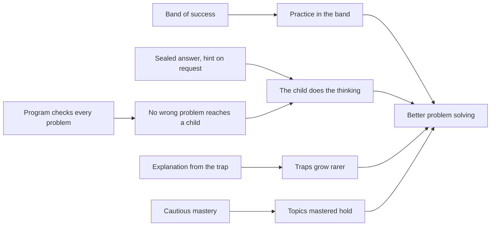

# The logic model

What MathTrail is built to change, the parts of it meant to change it, and why each part should work, written to the level of ESSA Tier 4.

## What is claimed

Tier 4, "demonstrates a rationale", is the first level of evidence in the US Department of Education's rules (34 CFR 77.1, as in force on 1 October 2026):

> Demonstrates a rationale means that there is a key project component included in the project's logic model that is supported by citations of high-quality research or evaluation findings that suggest that the project component is likely to significantly improve relevant outcomes.

> Logic model (also referred to as a theory of action) means a framework that identifies key project components of the proposed project (i.e., the active "ingredients" that are hypothesized to be critical to achieving the relevant outcomes) and describes the theoretical and operational relationships among the key project components and relevant outcomes.

The claim is that much and no more. No effect of MathTrail on children's learning has been measured; the [plan of study](#the-plan-of-study) below is how one will be. The works cited were read in full, and each, with the passage relied on, is in [sources.md](sources.md).

## The problem

- **Few children practise problems that need thinking rather than a procedure.** Olympiad-style problems, the kind that ask a child to reason about a situation nobody has shown them how to solve, are rare in a primary-school week, and a family that wants more of them has few places to turn that adapt to the child.
- **The chat assistants families already have are not safe tutors on their own.** Asked for answers, a general model is often wrong and teaches little: in one trial a ChatGPT-like tutor was right on 51 per cent of practice problems, and students who practised with it did 17 per cent worse on the exam that followed (S3); in another, 32 per cent of the hints a model wrote failed the checks (S2).
- **A fixed bank of problems runs out, and the best ones are in few languages.** This is the project's own observation, not a finding of research.

## Key components

The active ingredients, each a decision of the product's design:

| | Component | Supported by |
|---|---|---|
| C1 | A learner model of the Elo and IRT family holds practice in a band of likely success, neither so easy that it teaches little nor so hard that the child gives up | S1 |
| C2 | Olympiad-style problems with five options, every wrong option a catalogued trap: a mistake of reasoning, named | No work read yet (see [sources](sources.md#waiting-for-a-copy)) |
| C3 | A program checks every problem the chat's model writes before the child sees it: its structure, a solver that tries every option, the model's own check, readability, near-duplicates and the drawing | S2, S3 |
| C4 | The answer stays sealed until the child answers, and a hint comes only when asked for | S3 |
| C5 | Right after a wrong answer, the explanation starts from the trap behind the option chosen, and then goes through the solution | S4, S3 |
| C6 | A topic counts as mastered cautiously, from an estimate, and the mastery can be taken back | S5 |
| C7 | An adult, a parent or a tutor, runs the lesson in the family's own chat | A decision of the product, not claimed as evidence |

## The model

| Resources | Activities | Outputs | Short-term outcomes | Medium-term outcomes | Long-term outcomes | Impact |
|---|---|---|---|---|---|---|
| The free, open-source service (MIT); 17 topics, 20 traps and 603 reference problems with solvers; the chat hosts families already use; the adult's own Google Drive; the maintainer's time | An adult opens a lesson; the service picks the topic and difficulty; the chat's model writes a problem; the service checks it; the child answers on a card; the service records the answer, explains a wrong one and updates the ratings | Children each month, new children, tasks and answers, tasks a child a week and active days a child — the columns of the public view `months` | Practice stays in the band of success; few answers of "I don't know"; mistakes explained as they happen — the view `learning`, by months of use | Topics mastered rise and the traps a child falls for grow rarer over months of use — the views `learning`, `topics` and `traps_by_topic` | Better non-routine problem solving and more interest in mathematics, measured only by the third study below | Free enrichment in mathematics for grades 1–6 in 22 languages; open public goods: the problems, their traps and solvers, and the counts of how they are used |

## How the components lead to the outcomes

Each link is an "if … then", the reason for it, and how it is watched.

- **L1.** If practice is held in a band of likely success (C1), then children keep practising and learn more than at the easiest level, because adaptive practice at a moderate rate of success beat both random practice and the easiest practice in randomized trials (S1). Watched by the share right by months of use in the view `learning`, against the product's band of 70–85 per cent. The band is the product's choice, not the trial's: it lies above the rate the trial found best for learning, about 65 per cent, and near the one learners at school preferred, about 75 per cent (S1).
- **L2.** If every problem is checked by a program before the child sees it (C3), then a child is never taught from a wrong problem, because a model's mathematics fails often enough to harm learning when it goes unchecked (S2, S3). Watched by the service's own log, where every problem refused and why are counted; this is not a learning outcome but the condition for one.
- **L3.** If the answer stays sealed and hints come only when asked for (C4), then the child does the thinking, because a tutor that withheld answers and gave hints removed the harm an answer-giving tutor did to an exam taken alone (S3). Watched by the share of answers given after a hint, in the view `learning`.
- **L4.** If a wrong answer is explained at once, from the trap behind it (C5), then the child falls for that trap less often, because feedback right after each answer raised young children's mastery and transfer and cut the wrong strategies that come from misconceptions (S4), and a tutor built on known mistakes taught without harm (S3). Watched by the traps of each topic over months of use, in the views `topics` and `traps_by_topic`.
- **L5.** If a topic counts as mastered only cautiously, and the mastery can be lost (C6), then the topics a child is told are mastered are ones the child can solve, because practising to an estimated mastery doubled the share of students reaching it, while the estimate ran ahead of the students' real accuracy (S5). Watched by the topics mastered by months of use, in the view `learning`.
- **L6.** If the problems are olympiad-style, with their traps (C2), then children grow in non-routine problem solving. This link has no work read behind it yet.

## Assumptions and outside factors

- An adult is present and runs the lesson; MathTrail is not built for a child using a chat alone.
- The chat hosts keep supporting the protocol the app runs on, and their models keep writing problems of the quality the checks accept.
- The checks have limits: a problem can pass them and still be poorly worded or too like another, which is why the service's log counts every problem refused and why, and the adult sees every problem the child is given.
- The free tiers of the cloud the service runs on remain enough to keep it free.
- The free app has no school accounts: a school pilot means families using it at home.

## The plan of study

Tier 4 asks for an effort to study the effects that is planned or under way. Three studies, from the one that needs nothing new to the one that needs a partner:

1. **What the counts already show.** A descriptive study of the public counts, month by month from November 2026, with reports at six and twelve months. Its measures are fixed before the first public month, in this file, and each is a column of a public view:
   - the share of answers right, by months of use, against the band of 70–85 per cent;
   - the share of answers of "I don't know", and of answers after a hint, by months of use;
   - the topics mastered a child, by months of use;
   - the share of wrong answers each trap of a topic accounts for, month by month.

   It collects nothing new: it reads the views anyone can read, and it never combines them into new tables or takes one month from another to see a smaller group.
2. **What adults see.** A qualitative study with about ten parents, tutors or teachers, by interview or questionnaire, joined only by those who choose to. An adult describing a child's lessons is speaking about that child, so this study runs only once the maintainer decides to run it and an independent ethics review has approved it; until then it is planned.
3. **Whether it works.** A comparison with a partner — a school or a researcher — that holds the data itself, with the consent of parents and the approval of an ethics review, run only if it is funded. The public counts alone cannot show an effect: they have no comparison group.
